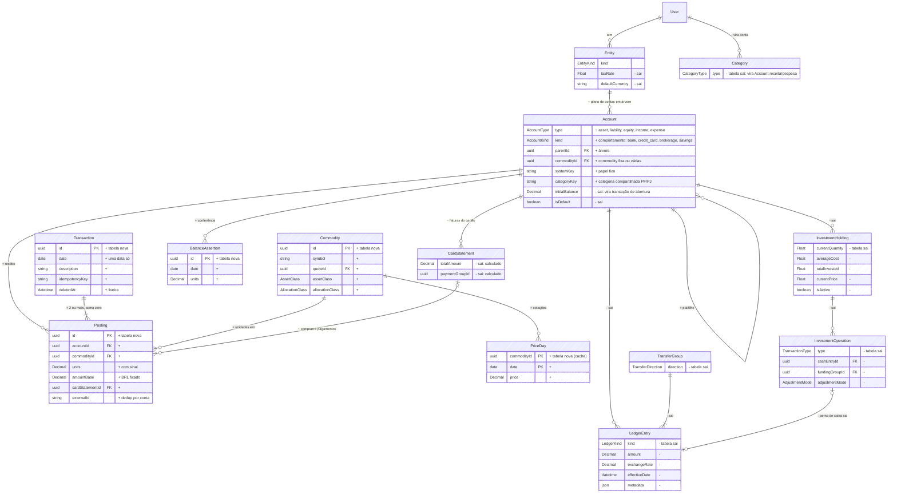

# Ledger v3: partidas dobradas

Status: aprovado em 09/10/2026. Este documento descreve o modelo de dados alvo do Capital e o caminho até ele. A implementação segue as fases da seção 10.

## 1. Resumo

O Capital passa a ter um ledger de partidas dobradas genérico:
- contas em árvore por entidade (ativo, passivo, patrimônio, receita e despesa);
- commodities (BRL, USD, tickers, cripto);
- transações cujos lançamentos somam zero.

**Investimentos deixam de ser um livro à parte.** Uma compra é uma transação com dois lançamentos na corretora: menos caixa e mais unidades do ativo ao custo. Posições, saldos, totais de fatura e valor de mercado são sempre calculados a partir dos lançamentos; nada disso fica gravado.

**Ficam fora do núcleo:** as regras brasileiras (plano de contas da ITG 1000, códigos oficiais, regime tributário, DRE e Balanço no formato do CFC). Elas viram relatório e export, num mapeamento de contas para códigos que não muda o modelo.

## 2. Por que

Os números de Investimentos (Carteira e Aportes) continuaram errados depois de vários PRs pequenos (#71 a #78). Os erros vinham do modelo, não do cálculo.

**1. Posição e caixa em livros separados.** A posição vive em `InvestmentHolding`/`InvestmentOperation`, e o caixa numa "perna" do ledger ligada por `cashEntryId` (`prisma/schema.prisma:839`, `onDelete: SetNull`). O significado de cada movimento era deduzido na leitura:
- primeira compra sem perna de caixa vira "posição inicial" (`src/server/modules/investments/lib/portfolio-timeline.ts:259`);
- posição sem operação entra pelo custo gravado (`:242`);
- o saldo inicial da corretora conta como aporte (`:299`);
- a perna na lixeira transforma a compra em fluxo.

**2. Valores gravados que deveriam ser calculados:**
- quantidade, preço médio, custo e preço gravados na posição, em Float;
- "Caixa disponível" reescreve `Account.initialBalance` sem lançamento (`src/server/modules/ledger/services/accounts.ts:159`);
- "Ajustar" sobrescreve a posição (`src/server/modules/investments/services/portfolio.ts:625`);
- o ganho realizado é calculado e descartado (`src/server/modules/investments/lib/holding-position.ts:120`).

**3. Moeda.** O saldo soma `amount` sem olhar a moeda (`src/server/modules/ledger/services/accounts.ts:174`), e uma conta aceita lançamentos em outra moeda. Na cópia local dos dados reais, a conta principal das duas PFs está marcada USD com 250 lançamentos em BRL, e um depósito de R$ 10.000 entrou como US$ 10.000.

**4. Quatro definições de "aporte":**
- Total aportado da Carteira;
- Aportes 12m (só transferências, mais o casamento de caixinhas por valor e data, `src/server/modules/investments/services/contributions.ts:314`);
- Todos os aportes;
- FIRE.

Elas nunca fecham entre si.

**5. Categorias não são contas.** Por isso não existe balanço da PJ, que é a razão do app (unificar PF e PJ de quem é autônomo).

Cada correção pontual explorava uma das deduções da leitura, e a correção seguinte a desfazia.

Referências seguidas: os guias de ledger da Modern Treasury (contas, transações e lançamentos, soma zero garantida também no banco, Decimal, idempotência), o Beancount (posição como commodity numa conta, custo do lote, ganho realizado lançado na venda, preços como série separada, asserções de saldo, abertura contra patrimônio) e o desenho de sistemas de *portfolio accounting*.

## 3. Princípios

1. **Contas, transações e lançamentos.** Toda transação soma zero em BRL, por entidade. O serviço checa, e o banco garante num trigger diferido.
2. **Fatos gravados, estado calculado.** Saldos, posições, preço médio, totais de fatura e valor de mercado saem dos lançamentos. A única exceção é o cache de preços (`PriceDay`), que é dado de mercado.
3. **Valor sempre na commodity da conta.** O valor em BRL (`amountBase`) é fixado na gravação.
4. **Correção = editar a transação inteira.** O histórico de desfazer (`MutationBatch`) é a trilha de auditoria; não há estorno nem versionamento.
5. **Modelo enxuto.** Nada de cache, coluna que remenda outra, tabela de diagnóstico ou flag de transição. Dado errado se conserta com script de migração pontual.
6. **Decimal em tudo.**

## 4. Modelo

### 4.1 Tabelas

```prisma
enum EntityKind  { personal business }
enum AccountType { asset liability equity income expense }
enum AccountKind { bank cash credit_card brokerage savings other }   // só contas patrimoniais
enum PriceSource { manual ptax ecb brapi yahoo coingecko }

model Entity {
  id        String     @id @default(uuid())
  userId    String
  kind      EntityKind
  name      String
  color     String?
  archivedAt DateTime?
  accounts  Account[]
}

model Account {
  id               String       @id @default(uuid())
  entityId         String
  parentId         String?      // árvore: mesmo tipo e mesma entidade
  name             String
  type             AccountType
  kind             AccountKind?
  commodityId      String?      // nulo = várias commodities (corretora); receita/despesa/patrimônio = BRL
  systemKey        String?      // papel fixo: opening_balances, realized_gains, ic.due_to_owner, groceries...
  categoryKey      String?      // receita/despesa: a mesma "categoria" em PF e PJ (regras, orçamentos e views)
  institution      String?
  externalRef      String?
  color            String?
  icon             String?
  creditLimit      Decimal?     @db.Decimal(18, 2)
  closingDay       Int?
  dueDay           Int?
  payFromAccountId String?
  archivedAt       DateTime?
  @@unique([id, entityId])
  @@unique([entityId, systemKey])
}

model Commodity {
  id              String  @id @default(uuid())
  userId          String
  symbol          String              // BRL, USD, PETR4, VOO, BTC, "CDB NU 2027"
  name            String
  quoteId         String?             // em que é cotada (VOO → USD, USD → BRL); nulo só para BRL
  assetClass      AssetClass?         // nulo = moeda
  allocationClass AllocationClass?
  fixedIncomeSubType FixedIncomeSubType?
  priceSource     PriceSource?
  priceSymbol     String?
  archivedAt      DateTime?
  @@unique([userId, symbol])
}

model Transaction {
  id                  String    @id @default(uuid())
  userId              String
  date                DateTime  @db.Date   // a única data contábil
  description         String
  payee               String?
  notes               String?
  idempotencyKey      String?
  importId            String?
  recurringRuleId     String?
  installmentPlanId   String?
  installmentNumber   Int?
  categorizedByRuleId String?
  deletedAt           DateTime?             // lixeira
  postings            Posting[]
  @@unique([userId, idempotencyKey])
}

model Posting {
  id              String  @id @default(uuid())
  transactionId   String
  entityId        String                       // = conta.entityId (FK composta)
  accountId       String
  commodityId     String
  units           Decimal @db.Decimal(28, 10)  // com sinal: débito +, crédito −
  amountBase      Decimal @db.Decimal(18, 2)   // BRL, com sinal, fixado na gravação
  memo            String?
  isTaxDeductible Boolean @default(false)
  cardStatementId String?                      // compra ou pagamento numa fatura
  externalId      String?                      // FITID do banco / id da corretora
  @@unique([accountId, externalId])
}

model BalanceAssertion {                       // "o extrato diz X unidades no dia D"
  id          String   @id @default(uuid())
  accountId   String
  commodityId String
  date        DateTime @db.Date
  units       Decimal  @db.Decimal(28, 10)
  importId    String?
  @@unique([accountId, commodityId, date])
}

model PriceDay {                               // cache de fechamentos e valores manuais
  commodityId String
  date        DateTime    @db.Date
  price       Decimal     @db.Decimal(24, 10)  // na moeda de cotação da commodity
  source      PriceSource
  @@id([commodityId, date])
}

model CardStatement {
  id          String   @id @default(uuid())
  accountId   String                           // conta de cartão (passivo)
  month       String                           // AAAA-MM
  closingDate DateTime @db.Date
  dueDate     DateTime @db.Date
  @@unique([accountId, month])
}
```

**O que muda nas outras tabelas:**
- **`InstallmentPlan`:** fica só com descrição e número de parcelas.
- **`RecurringRule`:** guarda a agenda e um modelo de lançamentos em JSON validado. Assim cobre também uma recorrência entre entidades, como o pró-labore mensal.
- **`Budget` e `CategorizationRule`:** passam a apontar para `categoryKey`. A entidade continua opcional no orçamento, e vazio continua valendo para todas.
- **`Attachment`:** pertence a uma transação ou a uma recorrência.
- **`MutationBatch` e `MutationRecord`:** sem mudança. O desfazer registra a transação inteira, cabeçalho mais lançamentos.

### 4.2 Regras garantidas no banco

**Trigger diferido no commit**, por transação tocada:
- Σ `amountBase` = 0 por entidade;
- Σ `units` = 0 quando todos os lançamentos são da mesma commodity;
- pelo menos 2 lançamentos;
- os lançamentos em contas `ic.*` (intercompany) somam zero entre as entidades.

**Checks e triggers imediatos:**
- o lançamento é da entidade da conta (FK composta `(accountId, entityId)`);
- só conta folha recebe lançamento;
- receita, despesa e patrimônio só aceitam BRL;
- conta com `commodityId` só aceita essa commodity;
- lançamento em BRL tem `amountBase = units`;
- `units` e `amountBase` não podem ser os dois zero.

**Verificado pelo serviço e pelos testes** (não é regra de banco): nenhuma posição de ativo fica negativa, e unidades zero implicam custo zero.

### 4.3 Investimentos

- **Posição:** Σ dos lançamentos de uma commodity numa conta. Unidades = Σ `units`; custo = Σ `amountBase`; preço médio = custo ÷ unidades.
- **Compra:** −caixa e +unidades ao custo. Taxas entram no custo (regra brasileira), num lançamento de 0 unidades com memo "taxa".
- **Venda:** o lançamento de saída usa −unidades × preço médio, arredondado. Se zera a posição, leva o custo restante exato. A diferença para o valor recebido vai para "Ganhos realizados" (títulos) ou "Variação cambial" (moedas).
- **Ativo comprado com outro ativo não-BRL** (USD → VOO): carrega o custo baixado, sem ganho.
- **Dinheiro recebido a mercado** (provento em USD, valor de uma venda em USD): unidades × câmbio do dia, ou a taxa informada.
- **Recalcular depois de um retroativo:** uma gravação retroativa recalcula os lançamentos de saída posteriores da mesma conta e commodity, na mesma transação de banco e no mesmo lote de desfazer. Isso substitui `recalculateHolding` e o gancho `afterUndo`.
- **Valor de mercado:** unidades × `PriceDay` × câmbio da moeda de cotação na data. Nunca guardado.

## 5. Diagrama ER do diff

Verde (`+`) entra, vermelho (`-`) sai, âmbar (`~`) muda.



**Enums:**

| Enum | Diff |
|---|---|
| `AccountType` | ~ passa a ser asset, liability, equity, income, expense |
| `AccountKind` | + bank, cash, credit_card, brokerage, savings, other |
| `EntityKind` | + personal, business |
| `PriceSource` | + manual, ptax, ecb, brapi, yahoo, coingecko |
| `LedgerKind`, `TransferDirection`, `InvestmentTransactionType`, `AdjustmentMode`, `CategoryType` | − saem |

**Também saem:**
- `CurrencyRateDay` e `Currency.manualRate` (absorvidos pelo `PriceDay`);
- `PortfolioSnapshot`, depois que o histórico de preços estiver completo;
- `Category`, que vira conta.

## 6. Planos de conta iniciais

São pequenos e editáveis. Folhas com `systemKey`; `ic.*` marca as contas intercompany.

**PF:**
- **Ativo:**
  - Disponível: Contas correntes, Dinheiro;
  - Reservas e objetivos: caixinhas de objetivo, que contam no Patrimônio e ficam fora da alocação;
  - Investimentos `investments`: Corretoras, Caixinhas de investimento, Previdência, Cripto;
  - Bens: Imóveis, Veículos;
  - Empresa: Participação `ic.equity_in_company`, A receber `ic.due_from_company`.
- **Passivo:** Cartões, Empréstimos, Empresa: A pagar `ic.due_to_company`.
- **Patrimônio:** Saldos iniciais `opening_balances`, Ajustes `adjustments`.
- **Receitas:** Salário, Pró-labore `ic.pro_labore_income`, Lucros recebidos `ic.distributions_received`, Rendimentos `interest`, Dividendos `dividends`, Ganhos realizados `realized_gains`, Variação cambial `fx_result`, Outras, A classificar `uncategorized_income`.
- **Despesas:** as categorias de sistema de hoje, mais Impostos, IR retido `withholding_tax`, Ajustes de conciliação `reconciliation` e A classificar `uncategorized_expense`.

**PJ:**
- **Ativo:** Bancos, Caixa, Aplicações `investments`, Sócio: A receber `ic.due_from_owner`.
- **Passivo:** Cartões, Empréstimos, Impostos a recolher, Sócio: A pagar `ic.due_to_owner`.
- **Patrimônio:** Capital `ic.owner_capital`, Lucros distribuídos `ic.distributions`, Saldos iniciais, Ajustes.
- **Receitas:** Receita de serviços, Rendimentos, Ganhos realizados, Variação cambial, Outras, A classificar.
- **Despesas:** Impostos sobre faturamento `revenue_tax`, Pró-labore `ic.pro_labore_expense`, Software, Contabilidade, Marketing, Escritório, Viagens, Tarifas, IR retido, Ajustes de conciliação, A classificar.

Não existe conta de lucros acumulados: o resultado acumulado é Σ receitas − despesas antes do período.

## 7. Exemplos

Formato: `conta unidades [commodity] (amountBase)`. Para BRL, unidades = amountBase.

| Caso | Lançamentos |
|---|---|
| Salário (PF) | Nubank +5.000 · Salário −5.000 |
| Receita PJ via Pix | Banco PJ +10.000 · Receita de serviços −10.000 |
| DAS | Impostos sobre faturamento +600 · Banco PJ −600 |
| Compra no cartão (03/10) | Restaurantes +120 · Cartão −120 (fatura 2026-10) |
| Pagamento da fatura | Cartão +3.000 (fatura 2026-10) · Nubank −3.000 |
| Parcelado 3× de 1.200 | 3 transações (03/10, 03/11, 03/12): Eletrônicos +400 · Cartão −400, uma em cada fatura, mesmo `installmentPlanId` |
| Estorno | Cartão +120 · Restaurantes −120 |
| Entre contas próprias | Inter +500 · Nubank −500 |
| Aporte (mesma entidade) | XP +10.000 · Nubank −10.000 |
| Remessa para USD | Avenue +6.000 USD (32.700) · Nubank −32.700 |
| Compra de 10 VOO a 500 + 1 USD de taxa | Avenue −5.001 USD (−27.255,45) · Avenue +10 VOO (+27.255,45) |
| Venda de 50 PETR4 a 40 (preço médio 30, taxa 5) | XP +1.995 · XP −50 PETR4 (−1.500) · Ganhos realizados −495 |
| Dividendo de 10 USD com 30% retido (câmbio 5,40) | Avenue +7 USD (37,80) · IR retido +16,20 · Dividendos −54,00 |
| Caixinha: depósito / rendimento / resgate com IR | Caixinha +1.000 · Nubank −1.000 / Caixinha +12,34 · Rendimentos −12,34 / Caixinha −1.012,34 · Nubank +1.009,56 · IR retido +2,78 |
| Abertura | Nubank +4.000 · Saldos iniciais −4.000; XP +100 PETR4 (3.000) · Saldos iniciais −3.000; Cartão −1.200 · Saldos iniciais +1.200 |
| Resgate USD → BRL com o valor recebido | Avenue −1.000 USD (−5.450, preço médio) · Nubank +5.320 · Variação cambial +130 |
| Conferência: extrato 4.210,55 × calculado 4.180,55 | Asserção falha em +30. Lança-se o que faltou, ou o ajuste explícito: Nubank +30 · Ajustes de conciliação −30. Na caixinha, a contrapartida é Rendimentos |

## 8. PF ↔ PJ

**Uma transação com lançamentos nas duas entidades.** Cada entidade fecha em zero, e as contas `ic.*` fecham entre si. Cada entidade tem livros completos, a operação é atômica (um desfazer só) e some o "pulo" pela conta principal (`src/server/modules/investments/services/funding.ts`).

| Fluxo | PJ | PF |
|---|---|---|
| Pró-labore (líquido) | Pró-labore `ic` +1.351,02 · Banco PJ −1.351,02 | Nubank +1.351,02 · Pró-labore `ic` −1.351,02 |
| Distribuição de lucros | Lucros distribuídos `ic` +5.000 · Banco PJ −5.000 | Nubank +5.000 · Lucros recebidos `ic` −5.000 |
| Aporte de capital | Banco PJ +10.000 · Capital `ic` −10.000 | Participação `ic` +10.000 · Nubank −10.000 |
| Empréstimo do sócio | Banco PJ +3.000 · Sócio a pagar `ic` −3.000 | Empresa a receber `ic` +3.000 · Nubank −3.000 |
| PF paga despesa da PJ | Software +100 · Sócio a pagar `ic` −100 | Empresa a receber `ic` +100 · Cartão PF −100 |
| PJ reembolsa | Sócio a pagar +100 · Banco PJ −100 | Nubank +100 · Empresa a receber −100 |

**Consolidado PF+PJ:** a soma das duas entidades, excluindo as contas `ic.*`. Não há lançamentos de eliminação.

## 9. Como as telas leem o modelo

- **Transações:**
  - Uma linha por transação, vista pelas entidades do filtro.
  - "Conta" é o lançamento patrimonial; "Categoria" é a conta de receita ou despesa do outro lado.
  - Patrimonial com patrimonial é transferência ("A → B"); mais de dois lançamentos mostra "Dividida (n)".
  - Os contratos da API (`src/server/modules/ledger/contracts/rows.ts`) mantêm o formato. O filtro "categoria" usa `categoryKey`.
  - KPIs:
    - Entradas = −Σ receitas;
    - Saídas = Σ despesas;
    - Aportes = fluxo externo das contas sob "Investimentos";
    - Resultado = Entradas − Saídas.
  
    Ganho realizado não entra em Entradas. Pró-labore e lucros aparecem como receita da PF.
- **Carteira e Aportes** (contas sob "Investimentos"):
  - Patrimônio = valor de mercado;
  - Total aportado = fluxo externo acumulado, abertura incluída;
  - Resultado = Patrimônio − Total aportado. É exato, e se decompõe em não realizado, realizado, proventos e IR;
  - Rentabilidade = Dietz mensal com `PriceDay`;
  - Aportes = a mesma lista de fluxos, então fecha com o Total aportado por construção.
- **Orçamentos:** Σ dos lançamentos nas contas de despesa da `categoryKey`. As compras no cartão contam pelo mês da fatura, via `cardStatementId`.
- **Fatura:** total = Σ das compras; pago = Σ dos pagamentos; o fechamento informado vira asserção de saldo.
- **Balanço e resultado por entidade, patrimônio da PF, consolidado:** consultas sobre os lançamentos.
- **MCP:** o adaptador `src/server/modules/mcp/lib/ledger-adapter.ts` mantém o contrato atual (`businessId`/`personalAccountId`, valor positivo + tipo + nome da categoria). Ferramentas novas de leitura e gravação com `dryRun` entram depois do corte.

## 10. Migração

**Estratégia: corte único, como no ledger v2** (`docs/ledger-v2-rollout.md`). Antes do corte, um script de projeção reconstruível gera as tabelas novas a partir das atuais, com ids determinísticos e um `legacy_v2.id_map`. Ele é ensaiado na cópia local (`capital_inv_dev`) e num dump de produção, num container descartável, quantas vezes forem precisas. Não há gravação dupla.

Por quê:
- cerca de 50 arquivos gravam no ledger, e duas rotas de gravação divergiriam;
- as tabelas novas são função pura das atuais;
- produção tem 2 usuários e rollback por dump já exercitado.

**Mapeamento:**

| Hoje | Vira |
|---|---|
| Receita ou despesa simples | Transação (id = id do lançamento) com 2 lançamentos: a conta e a conta da categoria na entidade (ou "A classificar") |
| Lançamento em moeda diferente da conta | Reexpresso na moeda da conta. Os casos são listados no precheck e decididos antes |
| `date` / `effectiveDate` | `date` |
| Transferência | Transação (id = id do grupo) com os lançamentos de cada perna. Distribuição, capital, reembolso e aporte entre entidades usam as contas intercompany |
| Pagamento de fatura | Cartão ↔ banco. A categoria que ficou na perna é descartada e registrada |
| `Account.initialBalance` | Transação de abertura contra Saldos iniciais |
| `InvestmentHolding` | `Commodity` + lançamentos |
| `InvestmentOperation` | Transação de commodity: compra, venda (com ganho realizado), provento, desdobramento. Ajuste absoluto vira diferença contra Ajustes. Lote de abertura vira abertura |
| Caixinha como lançamento solto na conta corrente | Transferência para a conta caixinha |
| `Category` | Contas de receita/despesa por entidade, com `categoryKey` = id da categoria |
| `Budget`, `CategorizationRule`, views salvas | Apontam para `categoryKey` (o valor não muda) |
| `CardStatement.totalAmount`/`paymentGroupId` | Calculados |
| Lotes de desfazer antigos | Ficam só para leitura |

**Fases (uma PR cada):**
1. **PR 0:** este documento e as regras de modelo de dados no `CLAUDE.md`.
2. **PR 1 — precheck e higiene dos dados.** Scripts só de leitura que listam os bloqueios: moedas trocadas, caixinhas casadas, posições desativadas com saldo, operações com perna na lixeira, categorias de investimento usadas. Eles também gravam as linhas de base: saldo por conta, total por entidade, categoria e mês, orçamentos, posições, faturas e KPIs. As correções pontuais são decididas caso a caso.
3. **PR 2 — schema novo, projeção e verificação**, sem mudar comportamento. Aceite: todas as regras passam e tudo bate com as linhas de base, ou a diferença está explicada.
4. **PR 3 — leitura no modelo novo**, só em desenvolvimento. Um harness de paridade compara o antigo com o novo em cada view salva, período e escopo, mais orçamentos e Carteira.
5. **PR 4 — gravação no modelo novo**, na branch `capital-ledger-v3`:
   - transações e desfazer;
   - cartão, parcelas, recorrência e lixeira;
   - investimentos;
   - importações e asserções;
   - contas e categorias;
   - MCP e assistente;
   - testes.
6. **PR 5 — corte:** migrações `…_ledger_v3_backfill` e `…_ledger_v3_retire`, com o runbook `docs/ledger-v3-rollout.md`.
7. **PR 6 — recursos:** árvore do plano de contas, balanço e resultado por entidade, asserções nas contas e na importação, lançamento dividido, histórico de preços.

**Verificação:**
- Depois de cada teste, roda uma checagem: Σ = 0 por transação e entidade; saldo = Σ lançamentos; Ativo = Passivo + Patrimônio + (Receitas − Despesas); nenhuma posição negativa.
- A migração é conferida no dump restaurado, conta por conta, categoria por mês, orçamento, posição e fatura, para os dois usuários.

## 11. Decisões

| # | Decisão |
|---|---|
| D1 | Compra no cartão na data da compra; orçamentos agrupam pelo mês da fatura |
| D2 | Categorias são contas por entidade com `categoryKey` compartilhada |
| D3 | Gasto em moeda estrangeira pelo câmbio do dia; a diferença para o custo médio vai para Variação cambial |
| D4 | Caixinhas de objetivo na subárvore "Reservas e objetivos" (no Patrimônio, fora da alocação) |
| — | Pró-labore pelo valor líquido (regime de caixa) |
| — | Correção editando no lugar, com o histórico de desfazer |
| — | Ganho realizado fora de Entradas |

## 12. Fora do núcleo

Ficam para relatórios, exports ou fases futuras:
- plano de contas e demonstrações brasileiras (ITG 1000: Balanço, DRE, DLPA), via mapa conta → código oficial;
- regime tributário;
- contas a receber e a pagar (regime de competência);
- fechamento de período com estorno;
- rendimento estimado pelo CDI;
- apuração de IR.
