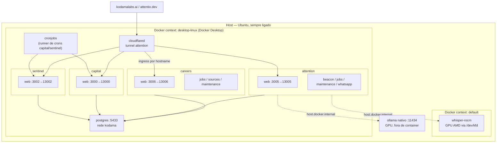

# Infraestrutura

O kodama-labs roda em um servidor Ubuntu ligado 24/7 na rede local, usado só por duas pessoas. `careers`, `attention`, `capital` e `sentinel` rodam como containers Docker nesse servidor; `kodamalabs` (a landing page pública) e `docs` continuam na Vercel — CDN global faz mais sentido pra tráfego público do que servir do IP residencial.

## Dois engines Docker — por quê

A máquina tem **dois daemons Docker separados**, com stores de imagem/volume/container independentes:

| Context | O que roda | Por quê |
|---|---|---|
| `desktop-linux` | Docker Desktop — postgres, redis, qdrant, ollama (vazio), e os 4 apps do kodama-labs | Motor principal. É o que aparece na UI do Docker Desktop (containers, logs, métricas de CPU/memória num só lugar) |
| `default` | Só o `whisper-rocm` | Docker Desktop no Linux roda dentro de uma VM leve, e essa VM **não tem acesso aos device nodes de GPU do host** (`/dev/kfd` do ROCm não existe lá — testado e confirmado). O whisper precisa da GPU AMD pra transcrição, então fica de fora do Desktop por necessidade técnica, não por escolha |

Todo comando `docker`/`docker compose` precisa do context explícito: `docker --context desktop-linux ...`. Nunca depender do context default do CLI — ele pode apontar pro engine errado.

O Ollama **nativo** (fora de container, na porta `11434`, com GPU) é o que o `attention` realmente usa pra triagem/rascunhos — existe também um container `ollama` no `desktop-linux` (porta `11435`), mas esse é só infra genérica sem GPU, vazio, não usado por nenhum app.

## Topologia

## Portas

| App | Dev local | Container prod | Nota |
|---|---|---|---|
| `capital` | 3000 | 13000 | |
| `sentinel` | 3002 | 13002 | |
| `attention` | 3005 | 13005 | mantém domínio próprio `attentio.dev` — PWA instalado + push subscriptions presos à origin |
| `careers` | 3006 | 13006 | |
| `docs` | 3001 | — | só Vercel |
| `kodamalabs` | 3003 | — | só Vercel |
| postgres | 5433 | 5433 | mesma instância pra dev e prod — só o **banco** muda, não a porta |

Prod usa `13xxx` de propósito: assim os containers e o `pnpm dev` local nunca disputam a mesma porta, e dá pra rodar os dois ao mesmo tempo sem conflito. O Cloudflare Tunnel não depende dessas portas de host de qualquer forma — ele acessa cada container pelo nome, na porta interna (`careers-web:3006`, etc.), então a porta publicada no host é só conveniência pra acesso direto via LAN.

## Separação dev / prod

Cada app tem duas databases no mesmo Postgres: `<app>` (prod, usada pelos containers) e `<app>_dev` (dev, usada por `pnpm dev` local). Ver [Fluxo de dev](/docs/infrastructure/dev-workflow) e [Deploy](/docs/infrastructure/deploy) para o dia a dia.

Essa separação existe por um motivo concreto, não teórico: um bug de auto-triagem no `careers` chegou a descartar em massa vagas reais em produção porque o processo que rodava em "modo de teste" apontava pro mesmo banco que produção. Separação por processo (dev local vs container) não teria evitado isso — só separação por **banco** evita, porque garante que nenhum código rodando localmente consegue tocar num dado real, não importa o bug.

Os dois arquivos de env por app:

- `apps/<app>/.env` — usado pelo `pnpm dev` e por scripts locais. Aponta pra `localhost:5433/<app>_dev`.
- `apps/<app>/.env.production` — usado pelos containers via `env_file:` no compose. Aponta pra `postgres:5432/<app>` (nome do container, porta interna). **Nunca commitado** — vive só no checkout principal do servidor.

## O que fica fora do Docker

- **`kodamalabs`** — landing page pública, Vercel.
- **`docs`** — este site, Vercel.
- **`whisper-rocm`** — precisa de GPU, fica no context `default`.
- **Ollama nativo** — idem, GPU.
- **Import do vault do Obsidian** (`careers`) — a VM do Docker Desktop não compartilha `/mnt/nas-shared` (só caminhos abaixo de `/home/kodama` são acessíveis por padrão). O import continua rodando direto no host quando necessário.
