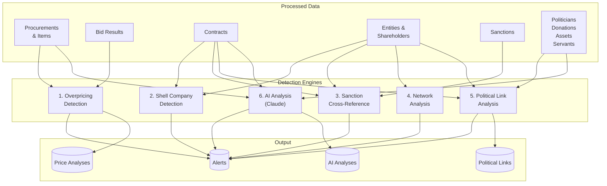
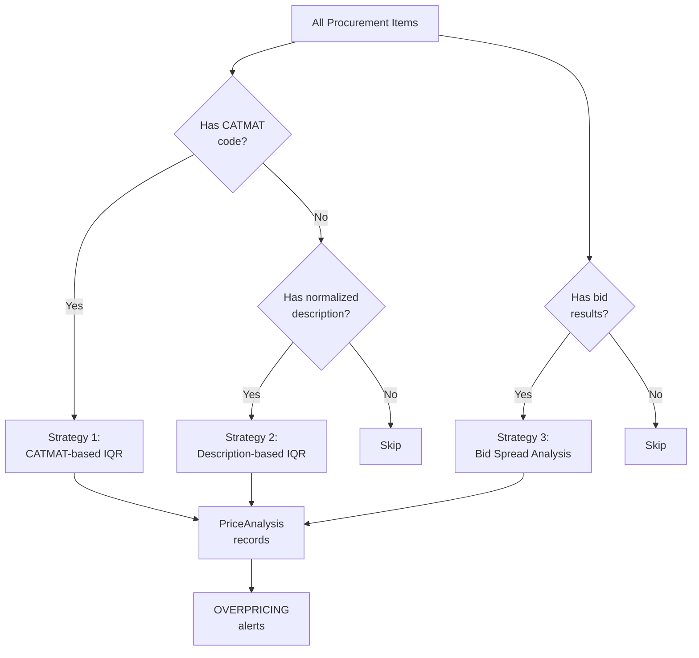
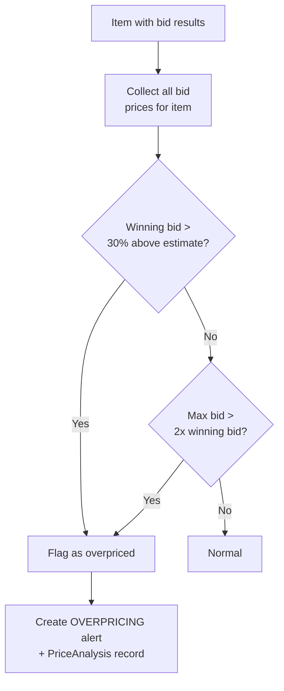
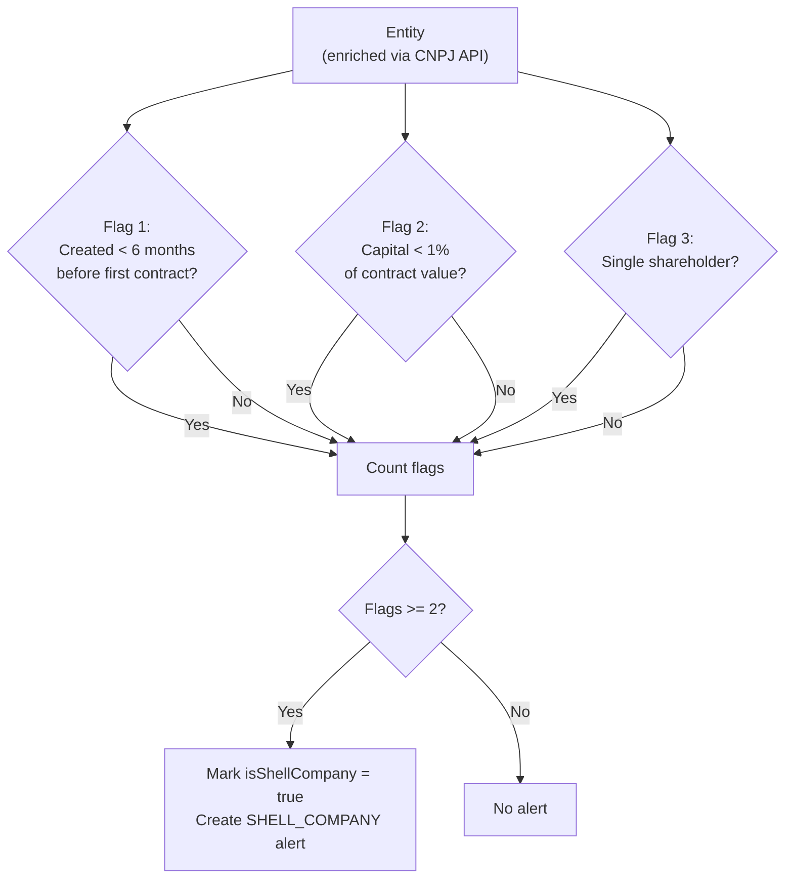
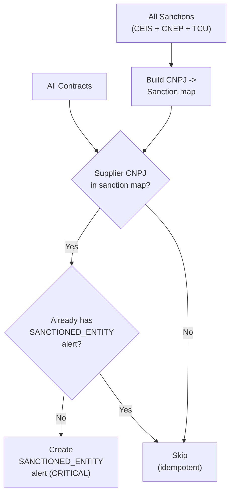
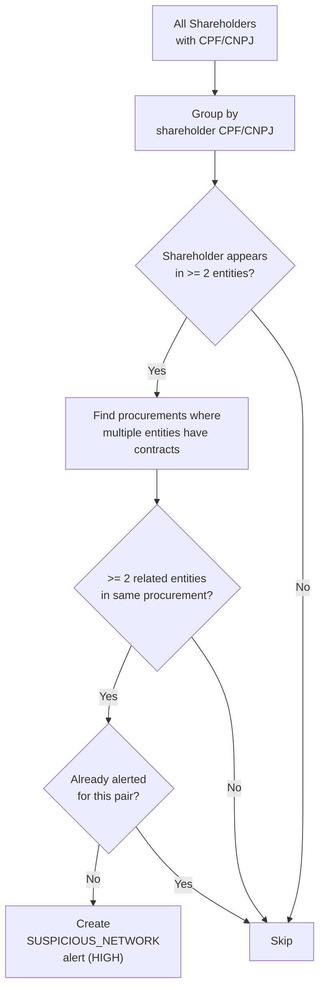
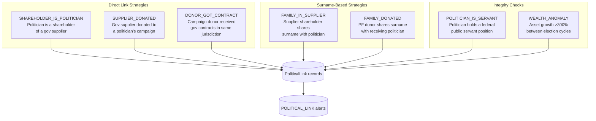
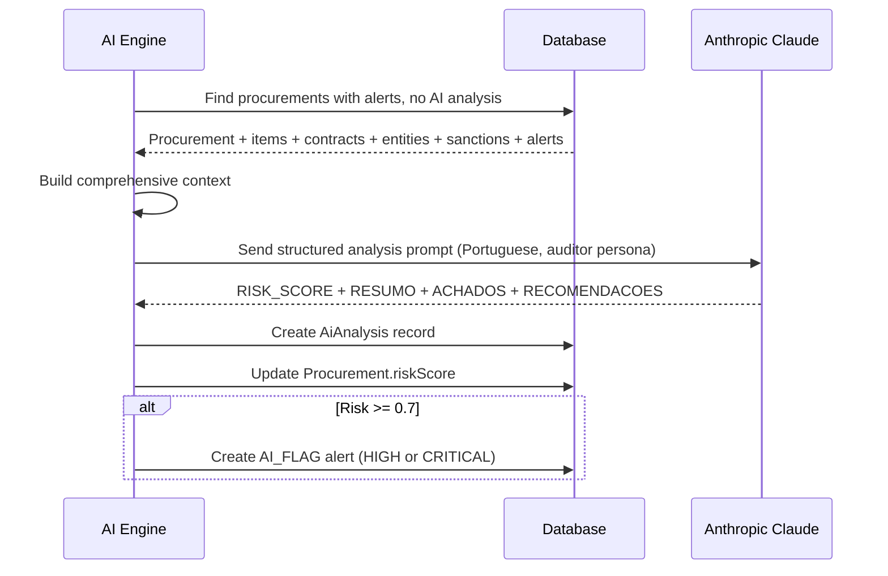
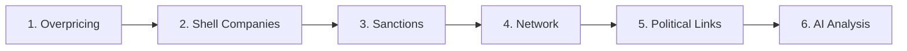

# Analysis Engines

Sentinel runs **six analysis engines** that examine processed procurement and political data for corruption indicators. Each engine produces `Alert` records with severity levels and detailed metadata. The engines work independently but feed into the AI engine, which synthesizes all signals into a comprehensive risk assessment.

## Engine Overview



---

## 1. Overpricing Detection

The overpricing engine is the most complex analysis, using **three independent strategies** to detect price anomalies. This multi-strategy approach ensures coverage even when standard material codes (CATMAT) are unavailable.

### Strategy Overview



### Strategy 1: CATMAT-Based IQR Analysis

Groups items by their **CATMAT material code** (standardized government product codes) and applies Interquartile Range (IQR) statistical analysis.

**How CATMAT codes are obtained:**
- Directly from PNCP API field `catalogoCodigoItem`
- Extracted from item descriptions using regex pattern `CATMAT\s*(\d{4,8})`

**Statistical Method:**

For each CATMAT group:
1. Collect all unit prices for items with the same code across all procurements
2. Calculate Q1 (25th percentile), Median (50th), Q3 (75th percentile)
3. Compute IQR = Q3 - Q1
4. **Upper bound** = Q3 + 1.5 x IQR
5. Flag items where: `unit_price > upper_bound` **OR** `deviation from median > 30%`

```
Example: CATMAT 240574 (Biscoito de Polvilho)
  Prices: [R$3.50, R$4.00, R$4.50, R$5.00, R$5.50, R$12.00]
  Q1 = R$4.00, Median = R$4.75, Q3 = R$5.50
  IQR = R$1.50, Upper Bound = R$7.75
  -> R$12.00 flagged (55% above median, above upper bound)
```

### Strategy 2: Description-Based IQR Analysis

When CATMAT codes are unavailable (which is the majority of items), the engine falls back to **normalized description matching**.

**Description Normalization Process:**
1. Convert to uppercase
2. Remove CATMAT references (already extracted)
3. Strip all non-alphanumeric characters
4. Collapse whitespace
5. Truncate to 120 characters

This creates a `catalogCode` field used for grouping. Items like "Bola de Campo 14 Gomos" and "BOLA DE CAMPO 14 GOMOS." normalize to the same key.

**Grouping Rules:**
- Items are grouped by the first **80 characters** of the normalized description
- Groups with **fewer than 3 items** are marked as `description_insufficient_data` (no overpricing assessment possible)
- Groups with 3+ items undergo the same IQR analysis as Strategy 1

```
Example: "OBRAS CIVIS PUBLICAS CONSTRUCAO"
  39 items found, prices ranging R$11,592 to R$25,341,963
  Extreme spread -> multiple CRITICAL alerts generated
```

### Strategy 3: Bid Spread Analysis

Analyzes the **competitive bidding process** for each item by comparing:
- The winning bid price vs. the estimated (budget) price
- The spread between highest and lowest bids



**What it detects:**

| Signal | Threshold | What it means |
|---|---|---|
| Estimate deviation | > 30% | Winning bid significantly above the government's own budget estimate |
| Bid spread ratio | > 2.0x | Suspicious gap between bids, may indicate fake competing bids |

### Overpricing Output

| Record | Fields |
|---|---|
| `PriceAnalysis` | Method used, median price, deviation %, IQR stats, sample size, overpriced flag |
| `Alert` (OVERPRICING) | Severity based on deviation, linked to procurement and item |

### Severity Mapping

| Deviation | Severity |
|---|---|
| 30% to 50% | MEDIUM |
| 50% to 100% | HIGH |
| Greater than 100% | CRITICAL |

---

## 2. Shell Company Detection

Identifies entities exhibiting characteristics of **shell companies** (empresas de fachada) commonly used in corruption schemes.

### Heuristic Flags

The engine evaluates three independent signals for each enriched entity:



| Flag | Indicator | Rationale |
|---|---|---|
| **Recently created** | Company opened less than 6 months before its first government contract | Shell companies are often created shortly before a specific procurement to submit a bid |
| **Undercapitalized** | Share capital is less than 1% of total government contract value | Legitimate companies have capital proportional to their operations; a company with R$1,000 capital winning a R$10M contract is suspect |
| **Single shareholder** | Only one person in the shareholder list (QSA) | Shell companies often have minimal corporate structure to reduce paper trail |

An entity is flagged when **2 or more** flags are present. This reduces false positives as any single flag in isolation could be legitimate.

### Data Requirements

This engine requires enriched entity data from BrasilAPI CNPJ:
- Incorporation date (`openDate`)
- Share capital (`capital`)
- Shareholder list from Quadro Societario e Administrativo (QSA)
- Associated contract values and dates

### Output

| Flag Count | Severity |
|---|---|
| 2 flags | MEDIUM |
| 3 flags | HIGH |

The entity is permanently marked as `isShellCompany = true` in the database and visible on the entity detail page.

---

## 3. Sanction Cross-Reference

Identifies **active government contracts with sanctioned suppliers**, entities that have been banned or penalized by government bodies but still appear as suppliers.

### Sanction Sources

| Source | Full Name | What it contains |
|---|---|---|
| **CEIS** | Cadastro de Empresas Inidoneas e Suspensas | Companies declared unfit or suspended |
| **CNEP** | Cadastro Nacional de Empresas Punidas | Companies punished under anti-corruption law |
| **TCU** | Tribunal de Contas da Uniao | Companies declared unfit by federal audit court |

### Algorithm



**Process:**
1. Loads all sanctions and builds a CNPJ-to-sanctions lookup map
2. Iterates over all contracts that don't already have a `SANCTIONED_ENTITY` alert
3. Checks if the contract's supplier CNPJ exists in the sanctions map
4. Creates a **CRITICAL** severity alert for each match

All `SANCTIONED_ENTITY` alerts are severity **CRITICAL** because contracting with a banned entity is a serious legal violation.

### Alert Metadata

The alert includes:
- Which sanction list(s) the entity appears in
- Sanction details (type, reason, dates, sanctioning body)
- Contract details (value, contracting organization)
- Links to both the contract and entity records

---

## 4. Network Analysis (Bid Rigging Detection)

Detects potential **bid-rigging conspiracies** by finding shared shareholders across companies that participate in the same procurement process.

### What It Detects

When two companies share a shareholder (same CPF/CNPJ) and both have contracts on the same procurement, this is a strong indicator of:

- **Bid rigging (cartel)**: Related companies submit coordinated bids ensuring one wins
- **Price fixing**: Related companies coordinate to inflate costs
- **Front companies**: One person controls multiple entities to circumvent single-supplier limits

### Algorithm



### Scenario

```
Company A (CNPJ: 12.345.678/0001-00)
  Shareholder: Joao Silva (CPF: 123.456.789-00)

Company B (CNPJ: 98.765.432/0001-00)
  Shareholder: Joao Silva (CPF: 123.456.789-00) <-- Same person

Procurement #2024/001 "Aquisicao de materiais":
  Contract 1: Company A -> R$ 500,000
  Contract 2: Company B -> R$ 480,000 <-- Both companies!

Result: SUSPICIOUS_NETWORK alert (Severity: HIGH)
```

### Deduplication

The engine stores the `shareholderCpf` in the alert's JSON `data` field and checks for existing alerts with the same CPF and procurement before creating duplicates, using Prisma JSON path filtering.

---

## 5. Political Link Analysis

Detects suspicious connections between **politicians**, **government suppliers**, **campaign donors**, and **public servants**. This engine uses seven detection strategies that cross-reference political data with procurement and entity data.

### Strategy Overview



### Strategy 1: SHAREHOLDER_IS_POLITICIAN

Finds politicians who are shareholders of companies that have government contracts.

| Factor | Effect on Severity |
|---|---|
| Same jurisdiction + has gov contracts | CRITICAL (strength: 0.9) |
| Has gov contracts (different jurisdiction) | HIGH (strength: 0.7) |
| Same jurisdiction, no contracts | HIGH (strength: 0.6) |
| Different jurisdiction, no contracts | MEDIUM (strength: 0.5) |

**Process:** Matches politician CPFs against shareholder CPFs in the `shareholders` table, then checks if the parent entity has government contracts.

### Strategy 2: SUPPLIER_DONATED

Detects government suppliers (entities with contracts) that also donated to political campaigns.

| Factor | Effect on Severity |
|---|---|
| Donation/contract ratio > 10% | CRITICAL (strength: 0.95) |
| Same state + donation > R$10k | HIGH (strength: 0.8) |
| Same state or donation > R$50k | HIGH (strength: 0.7) |

**Process:** Matches entity CNPJs against campaign donation donor CNPJs, then calculates the ratio between total donations and total contract value.

### Strategy 3: DONOR_GOT_CONTRACT

Finds campaign donors who received government contracts in the **same jurisdiction** as the politician they donated to.

| Factor | Effect on Severity |
|---|---|
| Contracts > R$100k and donation > R$10k | CRITICAL (strength: 0.9) |
| Default | HIGH (strength: 0.7) |

**Process:** For each politician, finds PJ donors, then checks if any donor has contracts in the politician's state or city.

### Strategy 4: FAMILY_IN_SUPPLIER

Uses **surname matching** to detect potential family members of politicians who are shareholders in government supplier companies.

| Factor | Strength | Severity |
|---|---|---|
| Same surname + same city | 0.7 | HIGH |
| Same surname + same state | 0.5 | MEDIUM |
| Same surname only | 0.3 | Not alerted (logged only) |

**Process:**
1. Extracts surnames from politician names and shareholder names using the surname utility
2. Filters out Portuguese prepositions (de, da, do, dos, das, e)
3. Normalizes names (uppercase, remove accents)
4. Checks for any overlapping surname tokens
5. Only generates alerts for matches with geographic proximity (same state or city)

### Strategy 5: FAMILY_DONATED

Detects individual (PF) campaign donors who share a surname with the receiving politician but have a different CPF.

| Factor | Strength | Severity |
|---|---|---|
| Donation > R$10,000 | 0.7 | HIGH |
| Donation > R$1,000 | 0.5 | MEDIUM |
| Small donation | 0.3 | Not alerted |

**Process:** Similar surname matching as Strategy 4, but applied to individual (PF-type) campaign donors.

### Strategy 6: POLITICIAN_IS_SERVANT

Flags politicians who have records as federal public servants — a potential dual-role conflict of interest.

| Severity | Strength |
|---|---|
| Always MEDIUM | 0.8 |

**Process:** Checks if any `PublicServant` records exist for politicians. One alert per politician regardless of how many servant records they have.

### Strategy 7: WEALTH_ANOMALY

Detects suspicious wealth growth by comparing a politician's total declared assets between consecutive election cycles.

| Growth | Severity | Strength |
|---|---|---|
| > 1000% | CRITICAL | ~0.95 |
| > 300% | HIGH | ~0.8 |
| ≤ 300% | Not flagged | — |

**Process:**
1. Groups all `CandidateAsset` records by election year
2. Sums total declared value per year
3. Compares consecutive years: if growth exceeds 300%, creates an alert
4. Only flags the first anomaly found per politician

### Surname Matching Utility

The surname engine (`apps/sentinel/src/lib/utils/surname.ts`) provides:

| Function | Purpose |
|---|---|
| `normalizeName(name)` | Uppercase, remove accents, trim |
| `extractSurnames(fullName)` | Returns surname tokens excluding first name and Portuguese prepositions |
| `extractLastSurname(fullName)` | Returns the final surname token |
| `hasSurnameOverlap(nameA, nameB)` | Returns true if any surname matches |
| `getOverlappingSurnames(nameA, nameB)` | Returns the list of matching surnames |

---

## 6. AI Analysis (Anthropic Claude)

The most comprehensive engine, using **Anthropic Claude** to perform deep risk assessment by analyzing all available data holistically. This engine runs **after** all other engines, consuming their alerts as input.

### Trigger Conditions

The AI engine only analyzes procurements that:
1. Have **at least one alert** from other engines (overpricing, shell company, etc.)
2. Do **not** already have an AI analysis record
3. Are prioritized by existing risk score (highest risk first)

### Process



### Context Building

For each procurement, the engine assembles a comprehensive data package:

| Data Layer | Information Provided to AI |
|---|---|
| **Procurement** | Organization, description, modality, total value, location |
| **Line Items** | Description, unit price, quantity, overpricing flag, deviation % |
| **Price Analysis** | Whether each item was flagged as overpriced and by how much |
| **Contracts** | Supplier name, CNPJ, contract value |
| **Entity Details** | Incorporation date, share capital, shell company flag |
| **Shareholders** | Names and roles of all company officers |
| **Sanctions** | Source and reason for any sanctions |
| **Existing Alerts** | All alerts already generated by other engines |

### AI Prompt

The prompt instructs Claude to act as a **Brazilian public procurement auditor** specializing in corruption detection:

```
Voce e um auditor especializado em compras publicas brasileiras.
Analise a seguinte licitacao e seus dados associados para
identificar sinais de corrupcao, fraude ou irregularidade.

Instrucoes:
1. Analise todos os dados fornecidos
2. Identifique padroes suspeitos: sobrepreco, empresas de fachada,
   conluio, conflitos de interesse, direcionamento
3. Para cada problema, explique evidencia e nivel de risco
4. Atribua score de risco de 0.0 a 1.0

Formato de Resposta:
RISK_SCORE: [0.0-1.0]
RESUMO: [resumo executivo]
ACHADOS: [lista de achados com evidencias]
RECOMENDACOES: [acoes recomendadas]
```

### Response Parsing

The engine extracts structured data from the AI response:

| Field | Extraction Method |
|---|---|
| `riskScore` | Regex match on `RISK_SCORE: (number)` |
| `summary` | Text between `RESUMO:` and `ACHADOS:` |
| `findings` | Text between `ACHADOS:` and `RECOMENDACOES:` |
| `recommendations` | Text after `RECOMENDACOES:` |

### Risk Score Interpretation

| Score Range | Meaning | Action |
|---|---|---|
| 0.0 to 0.3 | **Low risk** normal procurement | No alert |
| 0.3 to 0.5 | **Moderate** minor irregularities | No alert, documented |
| 0.5 to 0.7 | **Elevated** multiple flags | No alert, documented |
| 0.7 to 0.9 | **High risk** strong corruption indicators | AI_FLAG alert (HIGH) |
| 0.9 to 1.0 | **Critical risk** overwhelming evidence | AI_FLAG alert (CRITICAL) |

### Real Example Output

```
RISK_SCORE: 0.95

RESUMO: Esta licitacao apresenta evidencias extremamente preocupantes
de sobrepreco sistematico, com desvios que chegam a mais de 15.000%
do valor de mercado.

ACHADOS:
- Sobrepreco de 880% acima da mediana de mercado para reforma predial
- Capital social da empresa incompativel com valor do contrato
- Empresa constituida poucos meses antes da licitacao

RECOMENDACOES:
- Encaminhar ao Tribunal de Contas para auditoria especial
- Investigar socios da empresa fornecedora
- Comparar precos com banco de dados do Painel de Precos
```

---

## Alert Types Summary

| Alert Type | Engine | Severity Range | Trigger Condition |
|---|---|---|---|
| `OVERPRICING` | Overpricing (3 strategies) | MEDIUM to CRITICAL | Price deviation > 30% from median or bid spread > 2x |
| `SHELL_COMPANY` | Shell Company | MEDIUM to HIGH | 2+ of 3 heuristic flags (recently created, undercapitalized, single shareholder) |
| `SANCTIONED_ENTITY` | Sanctions | CRITICAL | Supplier CNPJ found in CEIS, CNEP, or TCU sanction list |
| `SUSPICIOUS_NETWORK` | Network | HIGH | Shared shareholders between suppliers in same procurement |
| `POLITICAL_LINK` | Political Links (7 strategies) | LOW to CRITICAL | Direct or surname-based connection between politicians and suppliers/donors |
| `AI_FLAG` | AI Analysis | HIGH to CRITICAL | Claude risk score >= 0.7 |

## Analysis Execution Order

The analysis engines run in a specific order within the cron job (`/api/cron/analyze`):



This order matters because:
- The **AI engine runs last** and consumes alerts from all other engines, including political links
- The **Political Link engine** requires processed politician, donation, asset, and servant data
- Procurements must have **at least one alert** before AI analysis triggers
- Each run processes items in batches (300 for overpricing, 100 for shell companies, 10 for AI)
- Multiple cron runs are needed to process all data

## Analysis Dependencies

| Engine | Required Data | Notes |
|---|---|---|
| Overpricing (CATMAT) | Items with CATMAT codes + unit prices | Highest precision, limited coverage |
| Overpricing (Description) | Items with descriptions + unit prices | Broad coverage, grouped by normalized text |
| Overpricing (Bid Spread) | Items with bid results | Detects estimate deviations and bid anomalies |
| Shell Company | Enriched entities (CNPJ API data + shareholders + contracts) | Requires successful BrasilAPI CNPJ enrichment |
| Sanctions | Sanction records + contracts with supplier CNPJs | Requires Portal da Transparencia API access |
| Network | Shareholders with CPF/CNPJ + contracts linked to procurements | Requires CNPJ enrichment for shareholder data |
| Political Links | Politicians + donations + assets + servants + entities + shareholders + contracts | Requires TSE and Câmara data ingestion + processing |
| AI | All of the above, best results with complete data | Requires `ANTHROPIC_API_KEY` environment variable |
