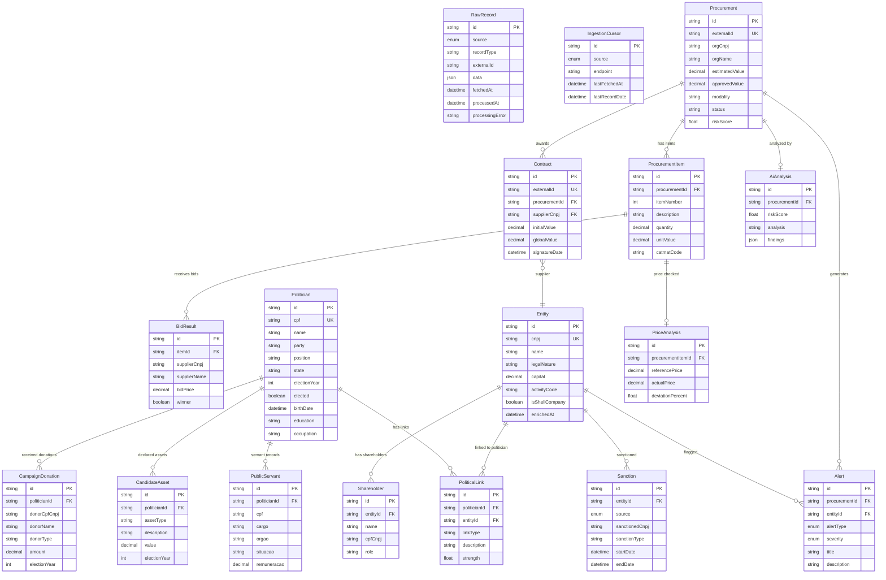

# Data Model

Sentinel's database is organized into three layers that mirror the pipeline architecture. Each layer builds on the previous one, from raw JSON storage to normalized relational tables to derived analysis output.

## Entity Relationship Diagram

---

## Layer 1: Raw Data

### raw_records

Stores the original JSON payload from each government API call. This is the source of truth — all processing derives from this table.

| Column | Type | Description |
|---|---|---|
| `id` | String (CUID) | Primary key |
| `source` | Enum | Data source: PNCP, CEIS, CNEP, TCU, CNPJ, etc. |
| `recordType` | String | Type within source: `procurement`, `contract`, `entity`, `sanction`, `procurement_item`, `bid_result`, `candidate`, `deputy`, `donation`, `asset`, `servant` |
| `externalId` | String | Unique identifier from the source system |
| `data` | JSON | Original API response payload |
| `fetchedAt` | DateTime | When the record was fetched |
| `processedAt` | DateTime? | When it was transformed (null = not yet processed) |
| `processingError` | String? | Error message if processing failed |

**Unique constraint:** `(source, recordType, externalId)` — prevents duplicate records from the same source.

### ingestion_cursors

Tracks incremental fetching progress for paginated APIs.

| Column | Type | Description |
|---|---|---|
| `id` | String (CUID) | Primary key |
| `source` | Enum | Data source |
| `endpoint` | String | API endpoint path |
| `lastFetchedAt` | DateTime | When the cursor was last updated |
| `lastRecordDate` | DateTime? | Date of the most recent record fetched |
| `status` | String? | Current status (active, error) |
| `errorMessage` | String? | Last error if any |
| `metadata` | JSON? | Additional cursor state |

**Unique constraint:** `(source, endpoint)`

---

## Layer 2: Processed Data

### procurements

Normalized procurement (licitação) records.

| Column | Type | Description |
|---|---|---|
| `id` | String (CUID) | Primary key |
| `externalId` | String | PNCP identifier (unique) |
| `orgCnpj` | String | Contracting organization CNPJ |
| `orgName` | String | Organization name |
| `orgUf` | String? | State (UF) |
| `orgMunicipio` | String? | Municipality |
| `modality` | String | Procurement modality (Pregão, Concorrência, etc.) |
| `modalityCode` | String? | Numeric modality code |
| `disputeMode` | String? | Dispute mode (open, closed) |
| `legalBasis` | String? | Legal article (Lei 14.133/2021, etc.) |
| `objectDescription` | String? | What is being procured |
| `estimatedValue` | Decimal? | Estimated value |
| `approvedValue` | Decimal? | Approved/awarded value |
| `status` | String? | Current status |
| `publishDate` | DateTime? | Publication date |
| `proposalDate` | DateTime? | Proposal opening date |
| `riskScore` | Float? | AI-assigned risk score (0.0–1.0) |
| `itemsEnrichedAt` | DateTime? | When line items were fetched |
| `rawRecordId` | String? | Reference to source raw record |

### procurement_items

Individual line items within a procurement.

| Column | Type | Description |
|---|---|---|
| `id` | String (CUID) | Primary key |
| `procurementId` | String (FK) | Parent procurement |
| `itemNumber` | Int | Sequence number within procurement |
| `description` | String? | Item description |
| `quantity` | Decimal? | Quantity being procured |
| `unitValue` | Decimal? | Unit price |
| `totalValue` | Decimal? | Total value (quantity × unit) |
| `unitOfMeasure` | String? | Unit (kg, un, m², etc.) |
| `catmatCode` | String? | Federal material catalog code |
| `ncmCode` | String? | NCM trade classification code |
| `benefitType` | String? | ME/EPP benefit type |

### bid_results

Individual bids submitted for procurement items.

| Column | Type | Description |
|---|---|---|
| `id` | String (CUID) | Primary key |
| `itemId` | String (FK) | Parent procurement item |
| `supplierCnpj` | String? | Bidder CNPJ |
| `supplierName` | String? | Bidder name |
| `supplierSize` | String? | ME, EPP, or other |
| `bidPrice` | Decimal? | Bid amount |
| `winner` | Boolean | Whether this bid won |
| `selectionCriteria` | String? | How the winner was selected |
| `createdAt` | DateTime | Record creation time |

### contracts

Government contracts awarded through procurements.

| Column | Type | Description |
|---|---|---|
| `id` | String (CUID) | Primary key |
| `externalId` | String | PNCP contract identifier (unique) |
| `procurementId` | String? (FK) | Linked procurement |
| `supplierCnpj` | String (FK) | Supplier entity CNPJ |
| `orgCnpj` | String? | Contracting organization CNPJ |
| `orgName` | String? | Organization name |
| `initialValue` | Decimal | Initial contract value |
| `globalValue` | Decimal? | Global/total value |
| `accumulatedValue` | Decimal? | Accumulated value with amendments |
| `objectDescription` | String? | What the contract covers |
| `contractType` | String? | Contract type classification |
| `signatureDate` | DateTime? | When signed |
| `startDate` | DateTime? | Effective start date |
| `endDate` | DateTime? | Effective end date |
| `amendmentsCount` | Int? | Number of amendments/aditivos |
| `hasSubcontractor` | Boolean? | Whether subcontracting is involved |

### entities

Companies and organizations involved in procurements.

| Column | Type | Description |
|---|---|---|
| `id` | String (CUID) | Primary key |
| `cnpj` | String | CNPJ (unique) |
| `name` | String | Legal name (razão social) |
| `tradeName` | String? | Trade name (nome fantasia) |
| `legalNature` | String? | Legal nature (Sociedade Limitada, MEI, etc.) |
| `openDate` | DateTime? | Incorporation date |
| `capital` | Decimal? | Share capital (capital social) |
| `activityCode` | String? | Primary CNAE code |
| `activityDesc` | String? | CNAE description |
| `address` | String? | Full address |
| `state` | String? | State (UF) |
| `city` | String? | City |
| `employeeCount` | Int? | Number of employees |
| `riskScore` | Float? | Entity risk score |
| `isShellCompany` | Boolean | Shell company flag (default: false) |
| `enrichedAt` | DateTime? | When CNPJ data was fetched |

### shareholders

Company shareholders (QSA — Quadro Societário e Administrativo).

| Column | Type | Description |
|---|---|---|
| `id` | String (CUID) | Primary key |
| `entityId` | String (FK) | Parent entity |
| `name` | String | Shareholder name |
| `cpfCnpj` | String? | Shareholder CPF or CNPJ |
| `role` | String? | Role (Sócio-Administrador, etc.) |

### sanctions

Government sanctions against companies or individuals.

| Column | Type | Description |
|---|---|---|
| `id` | String (CUID) | Primary key |
| `entityId` | String? (FK) | Linked entity (when CNPJ matches) |
| `source` | Enum | CEIS, CNEP, or TCU |
| `sanctionedCnpj` | String? | Sanctioned CPF/CNPJ |
| `sanctionedName` | String? | Sanctioned entity name |
| `sanctionType` | String? | Type of sanction |
| `startDate` | DateTime? | Sanction start date |
| `endDate` | DateTime? | Sanction end date |
| `sanctioningBody` | String? | Body that imposed the sanction |
| `sanctioningBodyUf` | String? | State of the sanctioning body |
| `legalBasis` | String? | Legal basis for the sanction |
| `processNumber` | String? | Related proceeding number |
| `penaltyValue` | Decimal? | Monetary penalty amount |

### price_references

Reference prices for material codes (future use with Compras.gov.br data).

| Column | Type | Description |
|---|---|---|
| `id` | String (CUID) | Primary key |
| `catmatCode` | String | Material catalog code |
| `description` | String | Material description |
| `referencePrice` | Decimal | Reference unit price |
| `source` | String | Where the reference came from |
| `collectedAt` | DateTime | When the reference was collected |

### politicians

Political candidates and elected officials.

| Column | Type | Description |
|---|---|---|
| `id` | String (CUID) | Primary key |
| `cpf` | String | CPF (unique) |
| `name` | String | Full civil name |
| `ballotName` | String? | Ballot name (nome de urna) |
| `party` | String? | Political party abbreviation |
| `position` | String | Elected position (Deputado Federal, Vereador, etc.) |
| `state` | String? | State (UF) |
| `city` | String? | City/municipality |
| `electionYear` | Int? | Most recent election year |
| `elected` | Boolean | Whether elected |
| `active` | Boolean | Currently active in office |
| `photoUrl` | String? | Photo URL (from Câmara API) |
| `externalId` | String? | External system ID (Câmara deputy ID) |
| `birthDate` | DateTime? | Date of birth |
| `birthState` | String? | Birth state (UF) |
| `birthCity` | String? | Birth city |
| `gender` | String? | Gender (DS_GENERO from TSE) |
| `education` | String? | Education level (DS_GRAU_INSTRUCAO) |
| `maritalStatus` | String? | Marital status (DS_ESTADO_CIVIL) |
| `occupation` | String? | Occupation (DS_OCUPACAO) |
| `email` | String? | Contact email (NM_EMAIL) |

### campaign_donations

Campaign donations received by politicians.

| Column | Type | Description |
|---|---|---|
| `id` | String (CUID) | Primary key |
| `politicianId` | String (FK) | Receiving politician |
| `donorName` | String | Donor name |
| `donorCpfCnpj` | String | Donor CPF or CNPJ |
| `donorType` | String? | PF (individual), PJ (company), or OUTRO |
| `amount` | Decimal | Donation amount in BRL |
| `electionYear` | Int | Election year |
| `description` | String? | Donation description |

### political_links

Detected connections between politicians and entities/suppliers.

| Column | Type | Description |
|---|---|---|
| `id` | String (CUID) | Primary key |
| `politicianId` | String (FK) | Linked politician |
| `entityId` | String? (FK) | Linked entity (when applicable) |
| `shareholderId` | String? | Related shareholder ID |
| `contractId` | String? | Related contract ID |
| `linkType` | String | Type: SHAREHOLDER_IS_POLITICIAN, SUPPLIER_DONATED, DONOR_GOT_CONTRACT, FAMILY_IN_SUPPLIER, FAMILY_DONATED, POLITICIAN_IS_SERVANT, WEALTH_ANOMALY |
| `description` | String | Human-readable description |
| `strength` | Float | Confidence score (0.0–1.0) |
| `data` | JSON | Structured metadata (shared surnames, amounts, jurisdictions) |

### candidate_assets

Asset declarations from TSE candidate registrations.

| Column | Type | Description |
|---|---|---|
| `id` | String (CUID) | Primary key |
| `politicianId` | String (FK) | Declaring politician |
| `assetType` | String | Asset type (DS_TIPO_BEM_CANDIDATO) |
| `description` | String | Asset description |
| `value` | Decimal | Declared value in BRL |
| `electionYear` | Int | Election year of declaration |

### public_servants

Federal public servant records linked to politicians.

| Column | Type | Description |
|---|---|---|
| `id` | String (CUID) | Primary key |
| `politicianId` | String (FK) | Linked politician |
| `cpf` | String | Servant CPF |
| `cargo` | String? | Position/rank |
| `funcao` | String? | Function |
| `orgao` | String? | Government body name |
| `orgaoCode` | String? | Government body code |
| `situacao` | String? | Employment status |
| `remuneracao` | Decimal? | Gross remuneration |
| `dataAdmissao` | DateTime? | Admission date |

---

## Layer 3: Analysis Output

### alerts

Flags generated by the detection engines.

| Column | Type | Description |
|---|---|---|
| `id` | String (CUID) | Primary key |
| `procurementId` | String? (FK) | Related procurement |
| `entityId` | String? (FK) | Related entity |
| `alertType` | Enum | OVERPRICING, SHELL_COMPANY, SANCTIONED_ENTITY, SUSPICIOUS_NETWORK, POLITICAL_LINK, AI_FLAG |
| `severity` | Enum | LOW, MEDIUM, HIGH, CRITICAL |
| `title` | String | Short description |
| `description` | String? | Detailed explanation |
| `data` | JSON? | Structured alert metadata |

### ai_analyses

AI-generated procurement risk assessments.

| Column | Type | Description |
|---|---|---|
| `id` | String (CUID) | Primary key |
| `procurementId` | String (FK) | Analyzed procurement |
| `riskScore` | Float | Risk score (0.0–1.0) |
| `analysis` | String | Full AI analysis text |
| `findings` | JSON? | Structured findings list |
| `recommendations` | String? | Suggested investigation steps |

### price_analyses

Statistical price analysis results.

| Column | Type | Description |
|---|---|---|
| `id` | String (CUID) | Primary key |
| `procurementItemId` | String (FK) | Analyzed item |
| `referencePrice` | Decimal | Market/historical reference price |
| `actualPrice` | Decimal | Actual procurement price |
| `deviationPercent` | Float | Percentage deviation from reference |
| `method` | String | Statistical method used (IQR, etc.) |

### job_runs

Operational log of all pipeline job executions.

| Column | Type | Description |
|---|---|---|
| `id` | String (CUID) | Primary key |
| `jobName` | String | Job identifier |
| `layer` | String | ingestion, processing, or analysis |
| `status` | Enum | RUNNING, COMPLETED, FAILED |
| `recordsIn` | Int? | Records read |
| `recordsOut` | Int? | Records written |
| `startedAt` | DateTime | Execution start |
| `completedAt` | DateTime? | Execution end |
| `error` | String? | Error message if failed |
| `metadata` | JSON? | Additional execution data |

---

## Enums

### DataSource

Identifies the origin of data:

| Value | Description |
|---|---|
| `PNCP` | Portal Nacional de Contratações Públicas |
| `TRANSPARENCIA` | Portal da Transparência (sanctions + servidores) |
| `COMPRAS_GOV` | Compras.gov.br |
| `CEIS` | Cadastro de Empresas Inidôneas e Suspensas |
| `CNEP` | Cadastro Nacional de Empresas Punidas |
| `TCU` | Tribunal de Contas da União |
| `CNPJ` | Receita Federal CNPJ (via BrasilAPI) |
| `MARKET_PRICE` | Market price references |
| `TSE` | Tribunal Superior Eleitoral (candidates, donations, assets) |
| `CAMARA` | Câmara dos Deputados (federal deputies) |

### AlertType

| Value | Engine |
|---|---|
| `OVERPRICING` | Overpricing detection |
| `SHELL_COMPANY` | Shell company detection |
| `SANCTIONED_ENTITY` | Sanction cross-reference |
| `SUSPICIOUS_NETWORK` | Network analysis |
| `POLITICAL_LINK` | Political link analysis (7 strategies) |
| `AI_FLAG` | AI analysis |

### Severity

| Value | Priority |
|---|---|
| `LOW` | Informational |
| `MEDIUM` | Worth reviewing |
| `HIGH` | Likely irregularity |
| `CRITICAL` | Strong corruption indicator |

### SanctionSource

| Value | Registry |
|---|---|
| `CEIS` | Empresas Inidôneas e Suspensas |
| `CNEP` | Empresas Punidas |
| `TCU` | TCU Inidoneos |

---

## Indexes

Key indexes for query performance:

| Table | Index | Purpose |
|---|---|---|
| `raw_records` | `(source, recordType, processedAt)` | Find unprocessed records by source |
| `raw_records` | `(source, recordType, externalId)` UNIQUE | Deduplication |
| `procurements` | `(publishDate)` | Chronological queries |
| `procurements` | `(riskScore)` | Risk-based sorting |
| `entities` | `(state, city)` | Geographic queries |
| `entities` | `(riskScore)` | Risk-based sorting |
| `entities` | `(isShellCompany)` | Shell company filtering |
| `sanctions` | `(source, sanctionedCnpj)` | Cross-reference lookups |
| `politicians` | `(cpf)` UNIQUE | CPF-based deduplication and lookup |
| `politicians` | `(party)` | Party-based filtering |
| `politicians` | `(state)` | Geographic filtering |
| `politicians` | `(position)` | Position-based filtering |
| `campaign_donations` | `(donorCpfCnpj)` | Donor cross-reference lookups |
| `campaign_donations` | `(politicianId)` | Politician's donation list |
| `political_links` | `(politicianId)` | Politician's link list |
| `political_links` | `(entityId)` | Entity's political connections |
| `political_links` | `(linkType)` | Filter by link strategy |
| `candidate_assets` | `(politicianId)` | Politician's asset history |
| `candidate_assets` | `(electionYear)` | Year-based comparison |
| `public_servants` | `(politicianId)` | Politician servant lookup |
| `public_servants` | `(cpf)` | CPF-based lookup |
| `alerts` | `(alertType, severity)` | Alert filtering |
