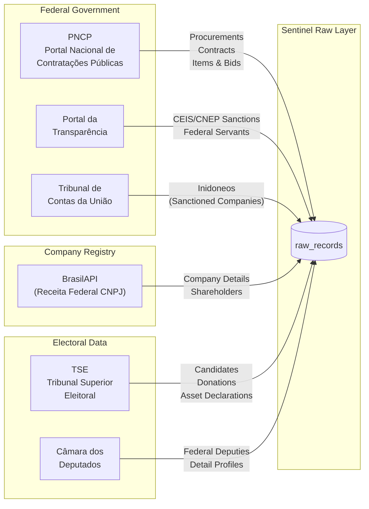

# Data Sources

Sentinel extracts data from seven Brazilian government data sources covering public procurements, contracts, company registrations, sanction lists, political candidates, campaign finances, and public servant records. Each source feeds into the raw data layer and is eventually processed into the relational model.

## Source Overview

## 1. PNCP — Portal Nacional de Contratações Públicas

The primary data source for public procurement and contract data across all levels of Brazilian government (Federal, State, Municipal).

| Property | Details |
|---|---|
| **Base URL (bulk)** | `https://pncp.gov.br/api/consulta` |
| **Base URL (details)** | `https://pncp.gov.br/pncp-api` |
| **Authentication** | None required |
| **Rate Limits** | Unofficial — requests throttled at 1/sec |
| **Data Format** | JSON (REST API) |

### Endpoints Used

| Endpoint | Purpose | Data Extracted |
|---|---|---|
| `/v1/contratacoes/publicacao` | Bulk procurement listings | Org details, modality, values, dates, legal basis, status, location (UF/municipality) |
| `/v1/contratos` | Bulk contract listings | Supplier CNPJ/name, contracting org, values, dates, object description, amendments |
| `/v1/orgaos/{cnpj}/compras/{year}/{seq}/itens` | Procurement items | Item descriptions, quantities, unit prices, CATMAT codes, NCM codes |
| `/v1/orgaos/{cnpj}/compras/{year}/{seq}/itens/{itemSeq}/resultados` | Bid results per item | Winning bidder, bid prices, supplier size, selection criteria |

### Data Volume

Each ingestion run fetches procurements and contracts published in the last 7 days. The bulk endpoints return paginated results (up to 500 per page). Detail endpoints are fetched per-procurement for item and bid data.

### Two-Phase Ingestion

PNCP data is ingested in two phases:

1. **Bulk ingestion** (`ingest-pncp`): Fetches recent procurement and contract listings from the bulk API
2. **Detail enrichment** (`ingest-pncp-details`): For each processed procurement, fetches individual line items and bid results from the detail API

This two-phase approach is necessary because the bulk API only provides summary data (total value, org name), while corruption analysis requires line-item detail (individual prices, competing bidders, item descriptions).

---

## 2. Portal da Transparência — CEIS & CNEP

The Federal Government's transparency portal provides two sanction registries:

| Registry | Full Name | Purpose |
|---|---|---|
| **CEIS** | Cadastro Nacional de Empresas Inidôneas e Suspensas | Companies banned from government contracts |
| **CNEP** | Cadastro Nacional de Empresas Punidas | Companies penalized under anti-corruption law (Lei 12.846/2013) |

| Property | Details |
|---|---|
| **Base URL** | `https://api.portaldatransparencia.gov.br/api-de-dados` |
| **Authentication** | API key required (`chave-api-dados` header) |
| **Rate Limits** | Official rate limits apply |
| **Data Format** | JSON (REST API) |

### Endpoints Used

| Endpoint | Data Extracted |
|---|---|
| `/ceis` | Sanctioned company CNPJ/CPF, sanction type, start/end dates, sanctioning body, legal basis |
| `/cnep` | Penalized company CNPJ/CPF, penalty type, penalty value, start/end dates, sanctioning body |
| `/servidores/por-cpf` | Federal public servant records by CPF — cargo, orgão, situação, remuneração, data de admissão |

### Federal Servant Lookup

The `/servidores/por-cpf` endpoint allows checking whether a specific person (by CPF) is or was a federal public servant. Sentinel uses this to detect politicians who simultaneously hold public servant positions — a potential conflict of interest.

| Property | Details |
|---|---|
| **Rate Limit** | ~30 requests/minute |
| **Batch Strategy** | 15 CPFs per run, 2.2s delay between requests |
| **Storage** | Full API response stored as `RawRecord` (`source=TRANSPARENCIA`, `recordType=servant`) |

### API Key

Access requires a free API key from [Portal da Transparência](https://portaldatransparencia.gov.br/api-de-dados/cadastrar-email). The key is passed via the `TRANSPARENCIA_API_KEY` environment variable.

---

## 3. TCU — Tribunal de Contas da União

Brazil's federal audit court publishes lists of companies declared unfit (inidoneos) for government contracting.

| Property | Details |
|---|---|
| **Base URL** | `https://sites.tcu.gov.br/dados-abertos/inidoneos-irregulares/arquivos` |
| **Authentication** | None required |
| **Rate Limits** | None (static file download) |
| **Data Format** | Pipe-separated CSV |

### Files Used

| File | Content |
|---|---|
| `inidoneos.csv` | Companies declared unfit for contracting — includes CNPJ/CPF, company name, proceeding number, deliberation type, start/end dates |

### Parsing

TCU data uses pipe (`|`) as the column delimiter rather than standard commas. Sentinel includes a custom CSV parser (`parsePipeSeparatedCsv`) that handles this format, including quoted fields and edge cases.

---

## 4. BrasilAPI — CNPJ (Receita Federal)

BrasilAPI provides a free, open wrapper around Brazil's Federal Revenue (Receita Federal) CNPJ registration data.

| Property | Details |
|---|---|
| **Base URL** | `https://brasilapi.com.br/api/cnpj/v1` |
| **Authentication** | None required (User-Agent header recommended) |
| **Rate Limits** | Unofficial — aggressive rate limiting on bulk requests |
| **Data Format** | JSON (REST API) |

### Endpoint Used

| Endpoint | Data Extracted |
|---|---|
| `/v1/{cnpj}` | Company name, trade name, legal nature, incorporation date, share capital, CNAE activity code, full address, tax status, shareholder list (QSA) |

### Enrichment Flow

CNPJ enrichment is triggered after processing creates `Entity` records from procurement/contract data. The flow:

1. Processing extracts supplier CNPJs from contracts and bids → creates `Entity` stubs
2. `ingest-cnpj` job picks up entities with `enrichedAt = null`
3. Fetches detailed company data from BrasilAPI
4. Stores raw JSON in `RawRecord`
5. `process-entities` job transforms raw data into entity fields + shareholder records

### Retry Logic

BrasilAPI can be unreliable under load. The CNPJ ingestion job includes:

- **10-second timeout** per request (AbortController)
- **3 retry attempts** before permanently skipping an entity
- **1-second delay** between requests to avoid rate limiting
- **Batch size of 20** entities per run
- CPFs (11 digits) are automatically skipped — only 14-digit CNPJs are processed

---

## 5. TSE — Tribunal Superior Eleitoral

TSE publishes open data about all Brazilian elections in CSV format, packaged as ZIP files on their CDN. Sentinel downloads and stores **all columns** from these CSVs as raw JSON records, following the ELT principle of extracting everything and processing selectively later.

| Property | Details |
|---|---|
| **Base URL** | `https://cdn.tse.jus.br/estatistica/sead/odsele` |
| **Authentication** | None required |
| **Data Format** | Semicolon-separated CSV inside ZIP archives (Latin-1 encoding) |
| **Rate Limits** | None (static file download), but files can be 50–200MB |

### Files Used

| File Pattern | Record Type | Content |
|---|---|---|
| `consulta_cand_{year}.zip` | `candidate` | Candidate registrations — CPF, name, party, position, state, city, election result, birth date, education, occupation, marital status, email, and 20+ additional columns |
| `prestacao_de_contas_eleitorais_candidatos_{year}.zip` | `donation` | Campaign donation receipts — donor name, CPF/CNPJ, amount, source type, candidate sequence number, and all additional CSV columns |
| `bem_candidato_{year}.zip` | `asset` | Candidate asset declarations — asset type, description, value, linked to candidate via sequence number |

### Election Years

Sentinel currently ingests data for the three most recent election cycles: **2020** (municipal), **2022** (state/federal), and **2024** (municipal).

### Raw Data Strategy

TSE CSV files contain 30+ columns per row. The ingestion layer stores **all columns as key-value JSON** (`Record<string, string>`), not just the fields needed today. A `_year` metadata field is added to each record. This means if we discover a useful column later (e.g., `NR_TITULO_ELEITORAL_CANDIDATO`), we just update the processing job — no need to re-download the 200MB ZIP files.

### Retry Logic

TSE ZIP files are large and downloads can time out. The fetcher includes:

- **10-minute timeout** per download (AbortController)
- **3 retry attempts** with exponential backoff (10s, 20s, 30s)
- **2-second delay** between election year downloads

---

## 6. Câmara dos Deputados API

The official API for the Brazilian House of Representatives provides data about current federal deputies.

| Property | Details |
|---|---|
| **Base URL** | `https://dadosabertos.camara.leg.br/api/v2` |
| **Authentication** | None required |
| **Rate Limits** | Unofficial — requests throttled to avoid 429s |
| **Data Format** | JSON (REST API) |

### Endpoints Used

| Endpoint | Data Extracted |
|---|---|
| `/deputados` | List of current deputies — name, party, state, photo URL, legislature |
| `/deputados/{id}` | Deputy detail — CPF, civil name, birth date, education level |

### Ingestion Strategy

1. Fetches the full list of current deputies (~513 members)
2. For each deputy, fetches detail profile to obtain CPF and enriched personal data
3. Both list and detail data are merged and stored as a single `RawRecord` per deputy
4. Batched at 5 deputies per concurrent request with 2-second delays between batches
5. Retry logic with exponential backoff for both list (3 retries) and detail (2 retries) calls
6. Handles HTTP 429 (Too Many Requests) with extended wait times

---

## 7. Compras.gov.br (Future)

The federal government's procurement platform provides catalog and supplier data.

| Property | Details |
|---|---|
| **Base URL** | `https://compras.dados.gov.br` |
| **Status** | Client implemented, not yet integrated into pipeline |
| **Data Available** | CATMAT material catalog (reference prices), registered suppliers |

This source is planned for use in price reference analysis — comparing procurement item prices against the federal catalog to detect overpricing.

---

## Data Source Matrix

| Source | Data Type | Auth | Format | Frequency | Records/Run |
|---|---|---|---|---|---|
| PNCP (bulk) | Procurements, Contracts | None | JSON | Every 10 min | ~100-500 |
| PNCP (detail) | Items, Bid Results | None | JSON | Every 10 min | ~30 procurements |
| Portal da Transparência | CEIS, CNEP sanctions | API Key | JSON | Every 10 min | ~100-200 |
| Portal da Transparência | Federal servants | API Key | JSON | Every 10 min | 15 CPFs/batch |
| TCU | Inidoneos | None | CSV | Every 10 min | Full list refresh |
| BrasilAPI | Company data | None | JSON | Every 10 min | 20 entities/batch |
| TSE (Candidates) | Candidate registrations | None | CSV (ZIP) | Weekly check | All rows per year |
| TSE (Donations) | Campaign donations | None | CSV (ZIP) | Weekly check | All rows per year |
| TSE (Assets) | Asset declarations | None | CSV (ZIP) | Weekly check | All rows per year |
| Câmara dos Deputados | Federal deputies | None | JSON | Weekly check | ~513 deputies |
