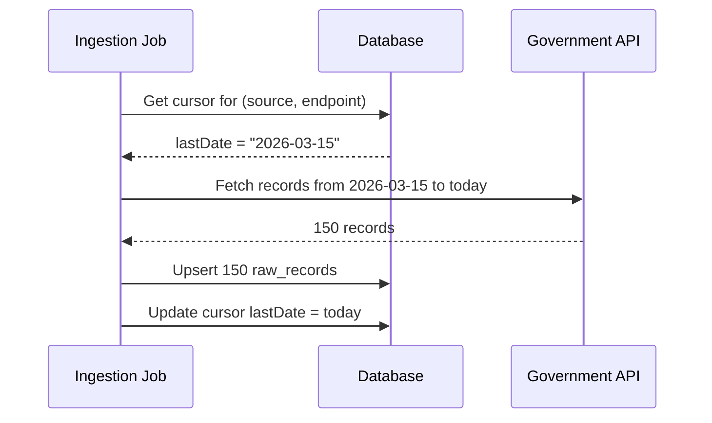
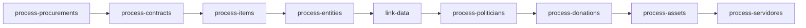

# ETL Pipeline

Sentinel's data pipeline follows an **ELT (Extract, Load, Transform)** pattern. Raw data is extracted from government APIs and loaded into a staging table (`raw_records`) before being transformed into normalized relational tables. This approach preserves the original data for auditability and allows reprocessing if transformation logic changes.

## Pipeline Overview

```mermaid
flowchart TB
    subgraph Ingest["Layer 1: Ingestion (every 10 min)"]
        direction LR
        I1["ingest-pncp\n(bulk listings)"]
        I2["ingest-pncp-details\n(items & bids)"]
        I3["ingest-sanctions\n(CEIS/CNEP/TCU)"]
        I4["ingest-cnpj\n(company data)"]
        I5["ingest-politicians\n(TSE/Câmara)"]
        I6["ingest-donations\n(TSE campaign)"]
        I7["ingest-assets\n(TSE declarations)"]
        I8["ingest-servidores\n(Transparência)"]
    end

    subgraph Raw["Staging"]
        RAW[(raw_records)]
        CUR[(ingestion_cursors)]
    end

    subgraph Process["Layer 2: Processing (every 5 min)"]
        direction LR
        P1["process-\nprocurements"]
        P2["process-\ncontracts"]
        P3["process-\nitems"]
        P4["process-\nentities"]
        P5["link-\ndata"]
        P6["process-\npoliticians"]
        P7["process-\ndonations"]
        P8["process-\nassets"]
        P9["process-\nservidores"]
    end

    subgraph Tables["Processed Tables"]
        T1[(procurements)]
        T2[(contracts)]
        T3[(procurement_items\nbid_results)]
        T4[(entities\nshareholders)]
        T5[(sanctions)]
        T6[(politicians\ndonations\nassets\nservants)]
    end

    subgraph Analyze["Layer 3: Analysis (every 5 min)"]
        direction LR
        A1["Overpricing"]
        A2["Shell\nCompanies"]
        A3["Sanctions\nCross-ref"]
        A4["Network\nAnalysis"]
        A5["Political\nLinks"]
        A6["AI\nAnalysis"]
    end

    subgraph Output["Output"]
        O1[(alerts)]
        O2[(ai_analyses)]
        O3[(price_analyses)]
        O4[(political_links)]
    end

    Ingest --> RAW
    Ingest --> CUR
    RAW --> Process
    Process --> Tables
    Tables --> Analyze
    Analyze --> Output
```

---

## Layer 1: Ingestion

Ingestion jobs extract data from external APIs and store the raw JSON payloads in the `raw_records` table. Each record is tagged with a `source`, `recordType`, and `externalId` for deduplication.

### Incremental Fetching with Cursors

To avoid re-fetching the same data, ingestion jobs use **cursors** stored in the `ingestion_cursors` table:

### Job: ingest-pncp

Fetches bulk procurement and contract listings from the PNCP consultation API.

| Property | Value |
|---|---|
| **Source** | `PNCP` |
| **Record Types** | `procurement`, `contract` |
| **Cursor Endpoints** | `/v1/contratacoes/publicacao`, `/v1/contratos` |
| **Date Range** | Last 7 days from cursor |
| **Pagination** | Up to 500 records per page, multiple pages per modality |
| **Modalities** | 15 contract modalities (Pregão Eletrônico, Concorrência, Dispensa, etc.) |

**Flow:**
1. Reads the cursor to determine the start date
2. Iterates over each modality code
3. Fetches paginated results for each modality within the date range
4. Upserts each result as a `raw_record` with a unique `externalId` (derived from org CNPJ + year + sequence number)
5. Updates the cursor after all pages are processed

### Job: ingest-pncp-details

Enriches procurements with line-item and bid data from the PNCP detail API.

| Property | Value |
|---|---|
| **Source** | `PNCP` |
| **Record Types** | `procurement_item`, `bid_result` |
| **Trigger** | Procurements where `itemsEnrichedAt` is null |
| **Batch Size** | 30 procurements per run |
| **Rate Limit** | 500ms delay between API calls |

**Flow:**
1. Finds up to 30 processed `Procurement` records that haven't been enriched
2. For each procurement, calls the items endpoint
3. For each item, calls the bid results endpoint
4. Stores items and bid results as separate `raw_record` entries
5. Marks the procurement as `itemsEnrichedAt = now()`

### Job: ingest-sanctions

Fetches sanction records from CEIS, CNEP, and TCU.

| Property | Value |
|---|---|
| **Sources** | `CEIS`, `CNEP`, `TCU` |
| **Record Type** | `sanction` |
| **Error Handling** | Each source runs in an isolated try/catch — one failure doesn't block others |

**Sources:**
- **CEIS/CNEP**: Paginated JSON from Portal da Transparência (100 per page, max 50 pages). Requires API key.
- **TCU**: Downloads and parses pipe-separated CSV from TCU's open data portal.

### Job: ingest-cnpj

Enriches entity records with company registration data from BrasilAPI.

| Property | Value |
|---|---|
| **Source** | `CNPJ` |
| **Record Type** | `entity` |
| **Trigger** | Entities where `enrichedAt` is null |
| **Batch Size** | 20 per run |
| **Retry Logic** | 3 attempts before giving up |
| **Timeout** | 10 seconds per request |

**Flow:**
1. Finds up to 20 entities with `enrichedAt = null`
2. Skips non-CNPJ identifiers (CPFs with 11 digits)
3. Checks for existing retry count in `raw_record.processingError`
4. Fetches company data from BrasilAPI with timeout
5. On success: stores raw record, marks entity as `enrichedAt`
6. On failure: increments retry counter in raw record; after 3 failures, marks entity as enriched to stop retrying

### Job: ingest-politicians

Fetches candidate data from TSE CSV files and current federal deputies from the Câmara API.

| Property | Value |
|---|---|
| **Sources** | `TSE`, `CAMARA` |
| **Record Types** | `candidate`, `deputy` |
| **Election Years** | 2020, 2022, 2024 |
| **Skip Logic** | Skips if fetched within the last 7 days |

**TSE Candidates Flow:**
1. Downloads `consulta_cand_{year}.zip` for each election year
2. Decompresses and parses CSV files (Latin-1 encoding, semicolon delimiter)
3. Stores **every CSV column** as a key-value JSON object in `RawRecord` — no selective parsing
4. Uses CPF as the deduplication key: `externalId = "{year}-{cpf}"`
5. Adds `_year` metadata field to each record
6. 2-second delay between election year downloads

**Câmara Deputies Flow:**
1. Fetches the full deputy list from `/deputados`
2. For each deputy, fetches detail profile from `/deputados/{id}` (CPF, civil name, birth date, education)
3. Merges list + detail data into a single record
4. Skips deputies without a CPF
5. Batched at 5 concurrent requests with 2-second delays between batches

### Job: ingest-donations

Fetches campaign donation data from TSE CSV files.

| Property | Value |
|---|---|
| **Source** | `TSE` |
| **Record Type** | `donation` |
| **Election Years** | 2020, 2022, 2024 |
| **Skip Logic** | Skips if fetched within the last 7 days |

**Flow:**
1. Downloads `prestacao_de_contas_eleitorais_candidatos_{year}.zip`
2. Stores all CSV columns as raw JSON (same ELT principle as candidates)
3. Minimal validation: filters rows that have a donor CPF/CNPJ and a positive amount
4. Stores **all donations** (PF and PJ), not just corporate — the processing layer decides what to use
5. `externalId = "{year}-{seq}-{cpfCnpj}-{amount}"`

### Job: ingest-assets

Fetches candidate asset declaration data from TSE CSV files.

| Property | Value |
|---|---|
| **Source** | `TSE` |
| **Record Type** | `asset` |
| **Election Years** | 2020, 2022, 2024 |
| **Skip Logic** | Skips if fetched within the last 7 days |

**Flow:**
1. Downloads `bem_candidato_{year}.zip`
2. Stores all CSV columns as raw JSON
3. Links to candidates via `SQ_CANDIDATO` (candidate sequence number)
4. `externalId = "{year}-{seq}-{order}"`

### Job: ingest-servidores

Checks whether known politicians are or were federal public servants using the Portal da Transparência API.

| Property | Value |
|---|---|
| **Source** | `TRANSPARENCIA` |
| **Record Type** | `servant` |
| **Batch Size** | 15 CPFs per run |
| **Rate Limit** | 2.2-second delay between requests |

**Flow:**
1. Loads all politician CPFs from the `Politician` table
2. Filters out CPFs that already have a `servant` RawRecord
3. For each CPF, queries `/servidores/por-cpf`
4. Stores the full API response (or `{_empty: true}` for 404s) in `RawRecord`
5. Handles 429 rate limiting with extended wait times

---

## Layer 2: Processing

Processing jobs transform raw JSON records into normalized relational tables. Each job processes records where `processedAt` is null and `processingError` is null.

### Processing Order

The processing route runs jobs in a specific order to satisfy data dependencies:

1. **Procurements first** — Contracts reference procurements
2. **Contracts second** — Creates entity stubs for suppliers
3. **Items third** — References procurements, creates entity stubs for bidders
4. **Entities fourth** — Enriches entity stubs with company data
5. **Link data fifth** — Links sanctions to entities (needs entities to exist)
6. **Politicians sixth** — Creates Politician records from raw TSE/Câmara data
7. **Donations seventh** — Links donations to politicians (needs politicians to exist)
8. **Assets eighth** — Links asset declarations to politicians
9. **Servidores last** — Links public servant records to politicians

### Job: process-procurements

| Input | Output | Batch Size |
|---|---|---|
| `raw_record` (PNCP, procurement) | `Procurement` | 100 |

Extracts from raw PNCP procurement JSON:
- Organization details (CNPJ, name, UF, municipality)
- Procurement metadata (modality, dispute mode, legal basis)
- Financial data (estimated value, approved value)
- Dates (publication, proposal opening, updated)
- Status and object description

### Job: process-contracts

| Input | Output | Batch Size |
|---|---|---|
| `raw_record` (PNCP, contract) | `Contract`, `Entity` (supplier stub) | 50 |

Extracts from raw PNCP contract JSON:
- Contracting organization details
- Supplier CNPJ and name → creates `Entity` stub if not exists
- Contract values (initial, global, accumulated)
- Dates (signature, start, end, publication)
- Contract metadata (type, category, process number, amendments count)
- Subcontractor information

Links contracts to existing `Procurement` records when a matching procurement external ID is found.

### Job: process-items

| Input | Output | Batch Size |
|---|---|---|
| `raw_record` (PNCP, procurement_item) | `ProcurementItem` | 100 |
| `raw_record` (PNCP, bid_result) | `BidResult`, `Entity` (bidder stub) | 100 |

Processes item details:
- Item descriptions, quantities, unit values
- CATMAT material codes and NCM codes
- Unit of measurement
- Links to parent procurement

Processes bid results:
- Winning bidder info
- Bid prices and selection criteria
- Supplier size (ME/EPP classification)
- Links to parent item and creates entity stubs for bidders

### Job: process-entities

| Input | Output | Batch Size |
|---|---|---|
| `raw_record` (CNPJ, entity) | `Entity` (enriched), `Shareholder` | 50 |

Transforms BrasilAPI CNPJ data into:
- Company details (name, trade name, legal nature, share capital)
- Activity info (CNAE code, description)
- Address (street, city, state, ZIP)
- Incorporation date
- Shareholder list (QSA) with names, CPF/CNPJ, roles, and entry dates

Replaces existing shareholders on each enrichment run to ensure data freshness.

### Job: link-data

| Input | Output | Batch Size |
|---|---|---|
| `raw_record` (CEIS/CNEP/TCU, sanction) | `Sanction` | All unprocessed |

Transforms raw sanction data into normalized `Sanction` records:
- Extracts sanctioned entity CPF/CNPJ
- Maps sanction type, dates, legal basis, and sanctioning body
- Links to existing `Entity` records when the CNPJ matches
- Handles different data structures from CEIS, CNEP, and TCU sources

### Job: process-politicians

| Input | Output | Batch Size |
|---|---|---|
| `raw_record` (TSE, candidate) | `Politician` | 500 |
| `raw_record` (CAMARA, deputy) | `Politician` | 500 |

Transforms raw candidate and deputy data into normalized `Politician` records using atomic `upsert` on CPF:

**From TSE candidate raw records (all CSV columns stored as JSON):**
- Core fields: CPF, name, ballot name, party, position, state, city, election year, result
- Enriched fields: birth date (`DT_NASCIMENTO`), birth state (`SG_UF_NASCIMENTO`), birth city (`NM_MUNICIPIO_NASCIMENTO`), gender (`DS_GENERO`), education (`DS_GRAU_INSTRUCAO`), marital status (`DS_ESTADO_CIVIL`), occupation (`DS_OCUPACAO`), email (`NM_EMAIL`)
- Column lookup uses regex matching on CSV header names for resilience across different TSE file versions

**From Câmara deputy raw records:**
- Core fields: CPF, civil name, ballot name, party, state, photo URL, external ID
- Enriched: education level, birth date
- Sets `active = true` and `position = "Deputado Federal"`

Backward-compatible: handles both new raw JSON format (all columns) and legacy typed format from older ingestion runs.

### Job: process-donations

| Input | Output | Batch Size |
|---|---|---|
| `raw_record` (TSE, donation) | `CampaignDonation` | 500 |

Links campaign donations to politicians:
1. Reads raw donation records (all CSV columns as JSON)
2. Looks up candidate sequence number (`SQ_CANDIDATO`) in raw candidate records to find the CPF
3. Maps CPF to `Politician.id` via the politicians table
4. Creates `CampaignDonation` with donor name, CPF/CNPJ, amount, type (PF/PJ/OUTRO), election year
5. Records without a matching politician are marked with a processing error

### Job: process-assets

| Input | Output | Batch Size |
|---|---|---|
| `raw_record` (TSE, asset) | `CandidateAsset` | 500 |

Links asset declarations to politicians:
1. Reads raw asset records from TSE `bem_candidato` CSVs
2. Looks up candidate via `SQ_CANDIDATO` -> raw candidate record -> CPF -> `Politician.id`
3. Creates `CandidateAsset` with asset type, description, value, and election year
4. Used by the wealth anomaly detection engine to find suspicious asset growth

### Job: process-servidores

| Input | Output | Batch Size |
|---|---|---|
| `raw_record` (TRANSPARENCIA, servant) | `PublicServant` | 500 |

Transforms Portal da Transparência servant API responses into normalized records:
1. Uses the `externalId` (which is the politician's CPF) to find the matching politician
2. Handles nested API response structures (cargo, função, órgão, situação, remuneração)
3. Parses Brazilian date formats for admission dates
4. Creates one `PublicServant` record per servant entry in the API response (a person may have multiple records)
5. Empty/404 responses are marked as processed without creating servant records

---

## Error Handling and Recovery

### Raw Record Error Tracking

When processing fails for a specific record, the error is stored in `raw_record.processingError`. This prevents the record from being picked up again (the query filters for `processingError: null`) while preserving the error message for debugging.

### Job Run Logging

Every job execution creates a `JobRun` record with:

| Field | Purpose |
|---|---|
| `jobName` | Identifies which job ran |
| `layer` | ingestion, processing, or analysis |
| `status` | RUNNING, COMPLETED, or FAILED |
| `recordsIn` | How many records were read |
| `recordsOut` | How many records were written |
| `startedAt` / `completedAt` | Timing |
| `error` | Error message if FAILED |

The Pipeline Monitor page in the frontend displays these records for operational visibility.

### Idempotency

All jobs are designed to be idempotent:
- **Ingestion**: Uses `upsert` on the unique `(source, recordType, externalId)` constraint
- **Processing**: Only processes records where `processedAt` is null; sets it on completion
- **Analysis**: Checks for existing alerts/analyses before creating duplicates

This means if a job crashes mid-run, the next execution will pick up exactly where it left off without creating duplicate data.
