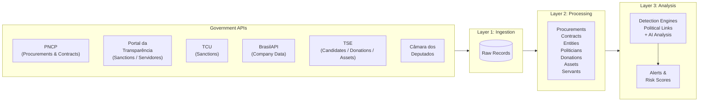

# Sentinel

Sentinel is an AI-powered government corruption tracker that automatically ingests Brazilian public procurement data and political records, processes them into a relational data model, and runs multi-layered analysis to detect irregularities including overpricing, shell companies, sanctioned entities, bid-rigging networks, and suspicious political connections.

## How It Works

## Architecture

Sentinel follows a three-layer **ELT (Extract, Load, Transform)** architecture:

| Layer | Purpose | Runs Every |
|---|---|---|
| **Ingestion** | Extracts raw data from government APIs and stores as JSON | 10 minutes |
| **Processing** | Transforms raw JSON into normalized relational tables | 5 minutes |
| **Analysis** | Runs detection engines and AI to generate alerts | 5 minutes |

Each layer is independent and idempotent — if a job fails, it picks up where it left off on the next run. Background jobs are orchestrated by Vercel cron routes (locally simulated by `infrastructure/cronjobs`).

## Tech Stack

- **Framework:** Next.js 16 (App Router), React 19
- **Database:** PostgreSQL with Prisma 6 (separate `sentinel` database)
- **AI:** Anthropic Claude for deep procurement analysis
- **Background Jobs:** Vercel Cron + custom job runner with logging
- **Styling:** Tailwind CSS 4, Radix UI, shadcn-style components
- **i18n:** next-intl (Portuguese / English)

## Documentation

<Cards>
  <Card title="System Architecture" href="/docs/sentinel/architecture">
    High-level system design, component interactions, and deployment topology
  </Card>
  <Card title="Data Sources" href="/docs/sentinel/data-sources">
    Government APIs, what data they provide, and how we connect to them
  </Card>
  <Card title="ETL Pipeline" href="/docs/sentinel/etl-pipeline">
    Detailed walkthrough of ingestion, processing, and data transformation stages
  </Card>
  <Card title="Analysis Engines" href="/docs/sentinel/analysis-engines">
    Corruption detection algorithms — overpricing, shell companies, sanctions, networks, and AI
  </Card>
  <Card title="Data Model" href="/docs/sentinel/data-model">
    Database schema, entity relationships, and data dictionary
  </Card>
</Cards>
